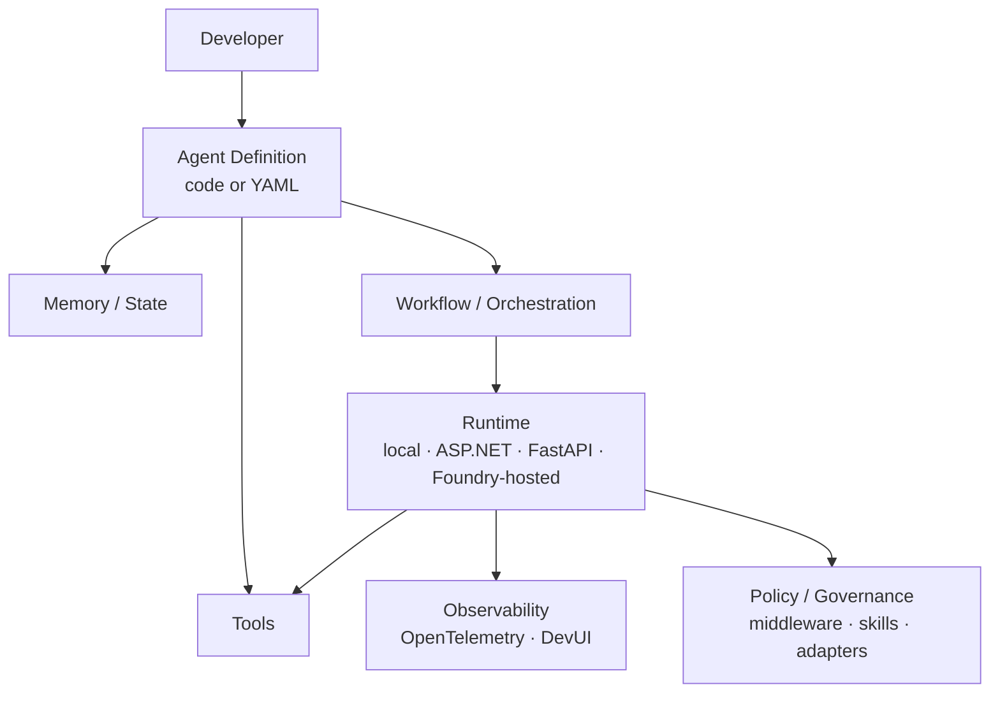
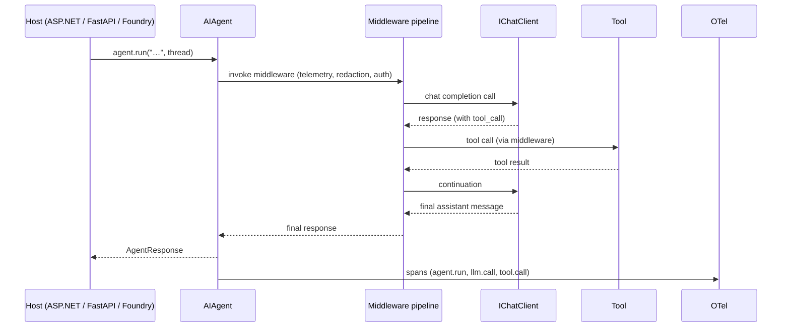
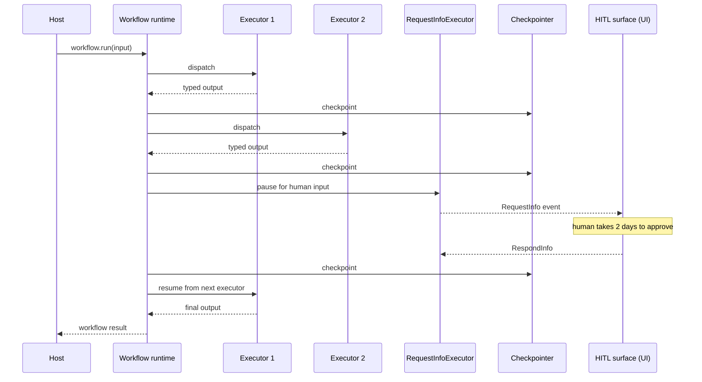

# Microsoft Agent Framework architecture

> A concept-by-concept walkthrough, anchored to the actual repository
> and Microsoft Learn docs. Source links sit at the bottom of the page.

## High-level shape



## Core abstractions

### `AIAgent` (.NET) / `BaseAgent` (Python)

A single base class everything else extends. Concrete agent types:

- **`ChatClientAgent`** — wraps an `IChatClient` (any provider).[^iChatClient]
- **`ChatAgent`** — convenience subclass of `ChatClientAgent` (Python).
- **`OpenAIResponsesClient`-backed agents** — for OpenAI Responses API
  directly.
- **`FoundryAgent`** — uses Microsoft Foundry's service-managed agents.
- **`AnthropicChatClient`-backed**, **`BedrockChatClient`-backed**,
  **`OllamaChatClient`-backed**, **`GitHubModelsClient`-backed** etc.

In .NET the canonical creation idiom is:

```csharp
using Microsoft.Extensions.AI;
using Microsoft.Agents.AI;

IChatClient chatClient = /* any IChatClient impl */;
AIAgent agent = chatClient
    .AsAIAgent(instructions: "You are a concise copywriter.", name: "Writer");
```

In Python:

```python
from agent_framework import ChatAgent
from agent_framework.openai import OpenAIChatClient

agent = ChatAgent(
    chat_client=OpenAIChatClient(model="gpt-4o"),
    instructions="You are a concise copywriter.",
    name="Writer",
)
```

> **(verified)** The .NET Blog explains this as "MEAI (`IChatClient`)
> provides the foundation — the universal interface for talking to any
> model. ... `.AsIChatClient()` bridges a provider's SDK to the MEAI
> abstraction; `.AsAIAgent()` takes that a step further and wraps it in
> an agent."[^net-blog]

### Tools

Functions, OpenAPI specs, MCP servers, or Foundry-hosted tools. In .NET
they're `AIFunction` instances; in Python they're `@ai_function`-decorated
callables. The framework handles JSON-schema generation, tool-call
parsing, parallel tool calls, and approval middleware.

### Middleware

A pipeline that wraps every agent run and tool call:

```text
[request] → telemetry → redaction → auth → retries → tool/agent → telemetry → [response]
```

Per the Microsoft Learn migration guide, **middleware is a MAF feature
that AutoGen lacks.**[^maf-mw]

### Memory & `AgentThread`

Two layers:

- **Per-thread state** (`AgentThread`) — conversation, tool results,
  metadata. Persisted via the workflow's checkpointer when used inside a
  workflow.
- **`IMemory` providers** — long-term memory (Foundry memory, Redis,
  custom). Queried during prompt assembly.

### Workflows

The graph engine. A `Workflow` is composed of `Executor`s connected by
`Edge`s. Built with `WorkflowBuilder`. Patterns shipped:

- **Sequential** — chain executors.
- **Concurrent** — fan-out / fan-in.
- **Handoff** — typed control transfer between agents.
- **Group chat** — moderated conversation among agents.
- **Magentic** — orchestrator + workers with task ledger.
- **Custom** — assemble executors and edges yourself.

Executors are typed: each has typed input and output, so the graph is
checked at build time. Workflow runs stream events; checkpointing is
attached at build time and persists every step.

```python
from agent_framework import WorkflowBuilder

workflow = (
    WorkflowBuilder()
        .add_executor(researcher)
        .add_executor(writer)
        .add_executor(editor)
        .add_edge(researcher, writer)
        .add_edge(writer, editor)
        .build()
)

async for event in workflow.run("Write about MCP"):
    print(event)
```

### `RequestInfoExecutor` (HITL)

A typed pause node. When reached, it persists a checkpoint and emits a
`RequestInfo` event the host can fulfil with a `RespondInfo`. The
workflow resumes from the checkpoint.

This is how MAF gives first-class HITL without bolting it onto a chat
loop.

### Skills

Reusable bundles of domain knowledge — files, snippets, code libraries —
that agents can discover and load. Designed to keep prompt-stuffing
manageable as agents tackle larger domains.

### Hosting & runtime

- **Local** — direct `python main.py` / `dotnet run`.
- **ASP.NET Core / FastAPI** — embed the agent in a web service.
- **Foundry-hosted agents** — managed runtime, identity, autoscale,
  policy. Two extra lines of code.
- **Agent Harness** — shell + filesystem + messaging loop for coding-style
  agents.

### DevUI

Browser debugger that visualises agent runs, tool calls, workflow events,
and state. Consumes the same OTel traces the framework emits.

### Front-end adapters

- **AG-UI** — a chat UI specifically for agent traces.
- **CopilotKit** — drop-in React copilot.
- **ChatKit** — a chat-component library.

## How a single agent run flows through the system



## How a workflow run flows through the system



## Provider matrix (May 2026)

| Provider | Client class (.NET) | Notes |
|---|---|---|
| Microsoft Foundry | `FoundryChatClient` | Service-managed agent option (`FoundryAgent`) |
| Azure OpenAI | `AzureOpenAIChatClient` | First-class |
| OpenAI | `OpenAIChatClient` | Includes Responses-API client |
| Anthropic | `AnthropicChatClient` | Tool calling + tracing |
| AWS Bedrock | `BedrockChatClient` | |
| Ollama | `OllamaChatClient` | Local models |
| Hugging Face | `HuggingFaceChatClient` | Via `Microsoft.Extensions.AI.HuggingFace` |
| GitHub Models / Copilot SDK | `GitHubModelsClient` | Free preview tier |
| Claude Code SDK | `ClaudeCodeClient` | Coding-agent flows |

> **(verified)** From the .NET Blog on MAF building blocks: "ChatClientAgent
> can be used with arbitrary IChatClient implementations, which exist on
> NuGet for AWS, Anthropic, Gemini, Hugging Face, ONNX Runtime GenAI,
> llama.cpp (LlamaSharp), Ollama, and more."

## How MAF differs from AutoGen at the contract level

| Contract | AutoGen | MAF |
|---|---|---|
| Common base | `BaseChatAgent` (per-package) | `AIAgent` / `BaseAgent` everywhere |
| Provider abstraction | per-client class (Python) | `IChatClient` (cross-language) |
| Orchestration substrate | conversation (group chat) | typed graph workflow |
| Cross-cutting concerns | DIY | middleware pipeline |
| HITL | `UserProxyAgent` | typed `RequestInfoExecutor` |
| Hosting | DIY | local / ASP.NET / FastAPI / Foundry-hosted / Agent Harness |
| Telemetry | OTel (since 0.4) | OTel-native + DevUI |
| Manifest | code | code + declarative YAML |
| Cross-language | Python primary | Python + .NET parity |

## Real-world reference samples in this repo

- Python: [`python/samples`](../python/samples/) (getting-started, agents,
  workflows, hosting).
- .NET: [`dotnet/samples`](../dotnet/samples/) — same hierarchy.
- Declarative agents: [`declarative-agents/`](../declarative-agents/).
- ADRs: [`docs/decisions`](../docs/decisions/).
- Feature specs: [`docs/features`](../docs/features/).

---

[^iChatClient]: ".NET Blog: Microsoft Agent Framework — Building Blocks for AI Part 3" confirms MAF "builds directly on top of `IChatClient`."
[^net-blog]: ".NET Blog: Introducing Microsoft Agent Framework (Preview)" describes the layered relationship between `IChatClient` (MEAI) and `AIAgent`.
[^maf-mw]: AutoGen → MAF Migration Guide, Microsoft Learn.
