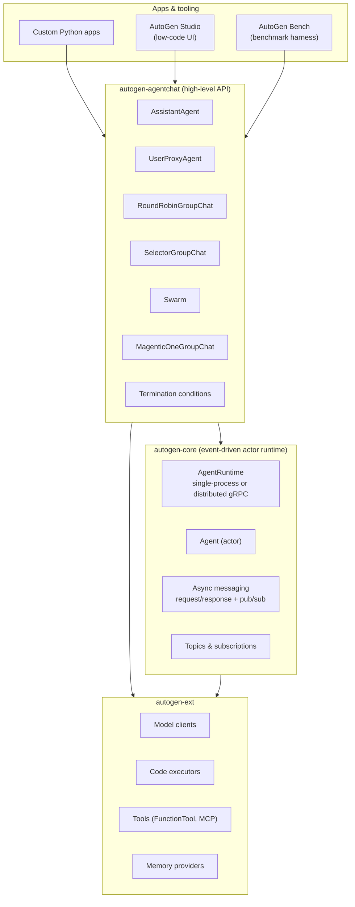

# AutoGen architecture

> A concept-by-concept walkthrough of the abstractions that defined AutoGen,
> including how they evolved from v0.2 to the v0.4 layered rewrite.

This page focuses on **what each abstraction is, why it exists, how it works,
where it shines, and where it strains in production.** v0.4 is the current
stable; the v0.2 line is still installable as `autogen-agentchat==0.2.x`.

## High-level layers (v0.4, since Jan 17 2025)



## Concepts

### 1. Conversable agent

**What.** An object that can receive messages and reply with messages. Same
shape for LLMs, tool executors, and humans.

**Why.** Polymorphism: the orchestrator doesn't need to know whether the next
participant is an LLM, a tool, or a person.

**How.** Subclass `ConversableAgent` (v0.2) or `BaseChatAgent` (v0.4).
Override `on_messages` (v0.4) or rely on base behaviour.

**Example (v0.4):**

```python
from autogen_agentchat.agents import AssistantAgent
from autogen_ext.models.openai import OpenAIChatCompletionClient

agent = AssistantAgent(
    name="planner",
    model_client=OpenAIChatCompletionClient(model="gpt-4o"),
    system_message="You break tasks into 3 steps.",
)
```

**Limitation.** Same abstraction for "LLM-driven free-text agent" and "typed
deterministic step" pushes governance and reliability concerns into runtime
configuration rather than the type system.

**Production consideration.** Wrap business-critical steps in *typed*
executors instead of `AssistantAgent`s when correctness matters more than
flexibility. (This is what MAF's `Workflow` makes ergonomic.)

### 2. UserProxyAgent

**What.** A conversable agent whose "reply" is either (a) human input, (b)
automatic execution of code emitted by another agent, or (c) a combination.

**Why.** Lets you mix humans and automatic execution into the same group
chat without special-casing them.

**How.** `human_input_mode={"ALWAYS"|"TERMINATE"|"NEVER"}`; optional
`code_execution_config` that hands code blocks to a `CodeExecutor`.

**Limitation.** Conflates *human* and *executor* into one role; production
HITL flows often want distinct semantics (approval vs continuation vs
rejection). v0.4 separates this somewhat (`UserProxyAgent` vs explicit code
executor).

**Production consideration.** For real HITL, build a structured approval
queue (id + payload + decision + audit), not just an `input()` prompt.

### 3. Group chat

**What.** A multi-agent orchestration where the next speaker is selected by
some policy.

**Variants in v0.4:**

- `RoundRobinGroupChat` — fixed rotation.
- `SelectorGroupChat` — an LLM picks the next speaker each turn.
- `Swarm` — agents handoff to each other via tool calls.
- `MagenticOneGroupChat` — Magentic-One orchestrator with task ledger.

**Why.** Encapsulates speaker selection and termination so the user only
specifies the participants.

**How.** Each variant is a class taking a list of agents and a termination
condition; subclasses customise speaker selection.

**Limitation.** Speaker selection by an LLM is non-deterministic; debugging
"why did it pick agent X here?" requires the trace. Selector prompts can
become a hidden dependency on the orchestrator model.

**Production consideration.** Prefer typed graph workflows when steps need
to be auditable; reserve `SelectorGroupChat` for genuinely open-ended
collaboration.

### 4. Tool / function calling

**What.** A Python function exposed to the LLM via a JSON Schema.

**How (v0.4):** `FunctionTool` wraps a callable; the framework derives the
schema from type hints + docstring, registers it with the model client, and
handles the `tool_call` → `tool_result` round-trip.

**Limitation.** Tools execute in the same process as the agent unless you
explicitly route them; security and observability are the developer's
responsibility.

**Production consideration.** Add policy-check middleware (or front the tools
with a gateway) before any external side effect. AutoGen 0.4 doesn't have a
first-class middleware concept — that gap is part of why MAF added one.[^maf-mw]

### 5. Code execution

**What.** A `CodeExecutor` runs code blocks emitted by an LLM agent.

**Variants:** `LocalCommandLineCodeExecutor`, `DockerCommandLineCodeExecutor`,
`JupyterCodeExecutor`, `AzureContainerCodeExecutor`.

**Why.** Code-as-action is the most general tool — let the model write
Python and you can do almost anything.

**Limitation.** Most powerful = most dangerous. Sandboxing, egress
allow-listing, and resource limits must be configured per executor.

**Production consideration.** Use the Docker or ACI executor; never
`LocalCommandLineCodeExecutor` in production. Treat tool outputs as
untrusted.

### 6. Message passing (v0.4)

**What.** Agents send typed messages over an `AgentRuntime`. Messages can
be request/response or pub/sub.

**Why.** Decouples agents from each other; enables distributed deployment
(gRPC) and OpenTelemetry instrumentation.

**How.** Each agent has an address (`AgentId`); the runtime routes messages.
Topics + subscriptions support broadcast patterns.

**Limitation.** Power user surface; the AgentChat layer hides most of this.

**Production consideration.** If you outgrow AgentChat group chats, drop
to Core actors directly — but at that point you're often better off in MAF
or LangGraph.

### 7. Conversation loop

**What.** The high-level invariant: receive → reason → optional tool call →
reply → repeat until termination.

**Why.** Gives you the entire ReAct pattern for free.

**Limitation.** Implicit state. If a turn fails halfway, you don't have a
clean checkpoint to resume from. AutoGen 0.4 added more durability hooks but
not a first-class durable workflow.

**Production consideration.** This is where MAF's `Workflow` adds the
biggest value: every step is a checkpoint.

### 8. Human-in-the-loop

**What.** Either via `UserProxyAgent` with `human_input_mode` or via custom
agents that pause for input.

**Limitation.** Tied to the conversation abstraction; not a workflow node.
A long-running "wait two days for officer approval" doesn't fit cleanly.

**Production consideration.** Treat HITL as a distinct typed step with a
durable inbox/outbox; don't conflate it with `input()`.

### 9. Termination conditions

**What.** Predicates that decide when a chat ends. v0.4 has composable
classes (`MaxMessageTermination`, `TextMentionTermination`,
`TokenUsageTermination`, etc.) joinable with `&` / `|`.

**Why.** Prevents runaway loops.

**Limitation.** They run *inside* the loop. Budget caps and SLA timeouts
are best enforced *outside* by the host (`asyncio.wait_for`, cost meters).

### 10. LLM configuration

**What.** Provider clients: `OpenAIChatCompletionClient`,
`AzureOpenAIChatCompletionClient`, `AnthropicChatCompletionClient`,
`OllamaChatCompletionClient`.

**Why.** Decouple agent from provider.

**Limitation.** Each is bespoke; there isn't a Microsoft-Extensions-AI-style
shared abstraction across the .NET / Python boundary. (This is one of the
gaps MAF closed by building on `IChatClient`.)

### 11. Multi-agent collaboration patterns

| Pattern | Variant | Best fit |
|---|---|---|
| Sequential pipeline | `RoundRobinGroupChat` (fixed order) | Predictable, simple flows |
| Open conversation | `SelectorGroupChat` | Brainstorm, debate |
| Triage / handoff | `Swarm` | Customer support, multi-domain routing |
| Planner + workers | `MagenticOneGroupChat` | Long, open-ended tasks with multiple specialists |
| Custom | Subclass `BaseGroupChat` | Anything else |

## Where the architecture strains in production

These show up across community write-ups, GitHub issues, and Microsoft's own
migration guidance — they're the *why* behind MAF.

1. **Conversation is the only first-class structure.** Long workflows with
   typed steps and durable checkpoints are awkward to express.
2. **No native middleware.** Cross-cutting concerns (logging, security,
   redaction, retries) must be hand-wired. The Microsoft Learn migration
   guide explicitly notes that *"Agent Framework introduces middleware
   capabilities that AutoGen lacks."*[^maf-mw]
3. **State is implicit.** Persisting and rehydrating a long-running chat
   requires DIY plumbing.
4. **Python-first.** .NET support exists in the community but isn't first-class.
5. **No managed runtime.** AutoGen Studio is a dev/auth tool, not a
   production hosting story.

## v0.2 → v0.4 migration cheat sheet

| v0.2 concept | v0.4 equivalent |
|---|---|
| `ConversableAgent` | `BaseChatAgent` (subclass of) |
| `AssistantAgent` (sync) | `AssistantAgent` (async; `on_messages`) |
| `UserProxyAgent` w/ code-exec | `UserProxyAgent` + `CodeExecutor` |
| `GroupChat` + `GroupChatManager` | `RoundRobinGroupChat` / `SelectorGroupChat` / `Swarm` |
| `register_function` | `FunctionTool` |
| `llm_config` dict | `model_client` (typed client class) |
| Sync `initiate_chat()` | `await Console(team.run_stream(...))` |

A full migration guide is at the AutoGen docs (`migration-guide.html`).

---

[^maf-mw]: AutoGen → Microsoft Agent Framework Migration Guide on Microsoft Learn explicitly states middleware is a MAF capability that AutoGen lacks.
