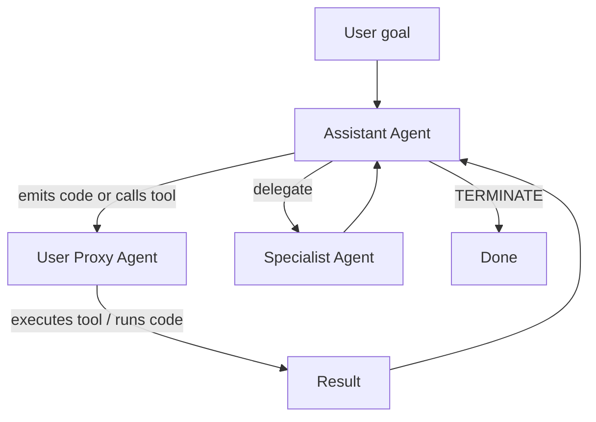

# AutoGen origin

> Where AutoGen came from, what gap it filled, and why it caught fire.

## In one sentence

AutoGen was a Microsoft Research project that turned *multi-agent conversation*
into a real programming model — agents you could define, give tools and
instructions to, and let them *talk to each other* (and to a human) until a
task was done.

## The problem AutoGen tried to solve

Before AutoGen (mid-2023), if you wanted to build "an agent that uses tools" or
"two agents that collaborate on a task" you typically wrote:

- A bespoke Python loop on top of LangChain or raw OpenAI calls.
- Manual prompt-stitching for tool descriptions and history.
- Custom plumbing for human-in-the-loop confirmations.
- Ad-hoc orchestration if you wanted >1 agent involved.

The pain points:

1. **Every team rebuilt the same thing.** No shared vocabulary for "agent",
   "tool call", "termination condition", or "speaker selection".
2. **Multi-agent was rare.** Single-agent ReAct loops were common; multi-agent
   patterns (debate, planner/executor, code-writer + code-reviewer) required
   serious work.
3. **Humans were second-class citizens.** Adding a human approval step meant
   custom messaging code, not a participant role.
4. **Research velocity was slow.** Comparing patterns required reimplementing
   them.

## What was innovative

The AutoGen paper introduced two ideas that, in hindsight, were obvious-once-stated:

1. **Conversable agents.** Agents are objects with a name, a system message
   (role), an LLM client, optional tools, and a method to *receive* a message
   and *reply* with a message. Same shape whether the agent is an LLM, a tool
   executor, or a human.
2. **Conversation programming.** Orchestration is expressed as conversation
   patterns — `RoundRobinGroupChat`, `SelectorGroupChat`, multi-agent chats
   with a manager — instead of ad-hoc Python loops.

## Why developers loved early AutoGen

In simple terms:

- **You could build a multi-agent demo in <100 lines.** Two `AssistantAgent`s
  + a `UserProxyAgent` + `initiate_chat()` and you had a working planner-executor.
- **Code execution was free.** `UserProxyAgent` could auto-run Python code
  emitted by the assistant agent, locally or in Docker.
- **Human-in-the-loop was a constructor flag.** `human_input_mode="ALWAYS" |
  "TERMINATE" | "NEVER"` covered most needs.
- **Termination was declarative.** "Stop when the message contains TERMINATE"
  worked as a baseline.

In technical terms:

- Same `ConversableAgent` base class for LLM agents, tool executors, and
  humans → polymorphic chat patterns.
- Tools were Python functions registered on the agent (`@register_function`
  or `register_for_llm`/`register_for_execution`).
- LLM provider was abstracted behind `LLMConfig` / `OpenAIWrapper`.
- Group chats were objects (`GroupChat` + `GroupChatManager`) with pluggable
  speaker-selection logic.

## A canonical "hello world" (v0.2 era)

```python
import autogen

config_list = [{"model": "gpt-4o", "api_key": "..."}]

assistant = autogen.AssistantAgent(
    name="assistant",
    llm_config={"config_list": config_list},
)

user_proxy = autogen.UserProxyAgent(
    name="user_proxy",
    human_input_mode="NEVER",
    code_execution_config={"work_dir": "coding"},
)

user_proxy.initiate_chat(
    assistant,
    message="Plot Microsoft and Apple stock prices for last 30 days.",
)
```

What this short program *does*:

1. The `UserProxyAgent` sends the human's request to the assistant.
2. The assistant emits Python code in a code block.
3. The proxy auto-executes it (sandboxed in `./coding/`), captures stdout,
   and replies with the result.
4. Steps 2–3 repeat until the assistant says `TERMINATE`.

You can see the appeal: a *real* agentic loop in a dozen lines.

## The simple-language version

> Imagine giving a coworker a task by Slack. They reply, ask a follow-up,
> maybe ping another teammate. Eventually they say "done." AutoGen turned
> that pattern into a Python library — every "person" is an agent (LLM,
> human, or tool executor), every "Slack message" is a structured call,
> and the conversation itself *is* the program.

## The first multi-agent diagram



## Why the framework went viral

**(inference, but well-supported by community signals)**

1. **Right idea, right time.** GPT-4 was a year old; tool-use was working;
   developers were ready for "agents that do things."
2. **Microsoft brand + MIT license.** A research-grade abstraction with the
   credibility of MSR but the openness of OSS.
3. **Excellent paper-to-code mapping.** The arXiv paper described exactly what
   the library shipped — researchers could replicate experiments quickly.
4. **Educational gravity.** Tutorials, university courses, YouTube creators
   all picked it up because the abstractions were teachable.
5. **AutoGen Studio.** A low-code UI made the library accessible to non-Python
   audiences, broadening adoption.

## What set the stage for what came next

AutoGen's success seeded its own succession problem:

- Conversation-as-orchestration is *delightful* for prototypes and *fragile*
  for long-running production workflows.
- The "every agent looks the same" elegance made governance harder — there
  was no built-in distinction between *typed* business steps and free-form
  agents.
- Production users wanted features (durable checkpoints, time-travel, typed
  workflows, .NET parity, managed hosting) that didn't fit cleanly into
  the conversable-agent abstraction.

That tension is the subject of the rest of this site.

## Sources

- AutoGen paper: <https://arxiv.org/abs/2308.08155>.
- Microsoft Research project page: <https://www.microsoft.com/en-us/research/project/autogen/>.
- AutoGen v0.2 docs (multi-agent conversation framework): <https://microsoft.github.io/autogen/0.2/>.
- See [`references.md`](references.md) for the full list.
