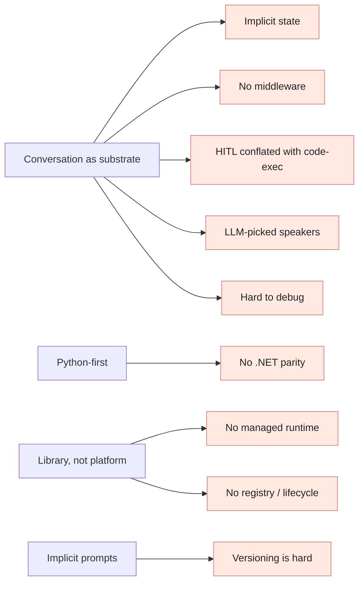

# Where AutoGen ran into roadblocks

> Every roadblock below is framed as **(a)** the original design decision,
> **(b)** why it was reasonable at the time, **(c)** how it became a
> limitation at scale, **(d)** the failure mode, **(e)** what a better design
> looks like, and **(f)** how Microsoft Agent Framework appears to address it.
>
> Verified items are cited; broader patterns are marked **(inference)**.

## Roadblock 1 — Conversation as the only first-class structure

**Original design.** Orchestration is *expressed* as conversation: agents
exchange messages, a manager picks who talks next, a termination condition
ends it.

**Why it was reasonable.** The core insight of the AutoGen paper. It made
multi-agent prototypes possible in a hundred lines of Python.

**How it became a limitation.** Production workflows have steps that aren't
naturally conversational — "validate JSON," "call this idempotent API,"
"wait two days for officer approval," "branch on a numeric threshold."
Forcing those into a chat loop is awkward and brittle.

**Failure mode.** Long-running flows lose traceability ("which message did
the side-effect happen on?"). Replaying or resuming is hard. Adding a
retry policy means hand-coding it inside an agent.

**Better design.** A *typed graph* of executors where conversation is one
kind of node, not the substrate. Steps have typed inputs/outputs and
explicit checkpoints.

**MAF's response.** Workflows are typed graphs (`Workflow`, `Executor`,
`Edge`, `WorkflowBuilder`). Conversation patterns are *workflow templates*,
not the only model.

## Roadblock 2 — No first-class middleware

**Original design.** Cross-cutting concerns (logging, redaction, retries,
security checks) are bolted on inside agents or via Python decorators
around tools.

**Why it was reasonable.** The agent abstraction was small; researchers
didn't need a middleware pipeline.

**How it became a limitation.** Enterprise teams need consistent
policy enforcement *across* agents and tools — PII redaction before
LLM calls, rate-limit checks before tool calls, telemetry around
everything.

**Failure mode.** Inconsistent enforcement. Some agents have redaction;
others don't. Adding a new policy requires changing every agent.

**Better design.** A request/response/exception middleware pipeline, like
ASP.NET Core or Express, that sits around the agent run and tool call.

**MAF's response.** Microsoft's own migration guide states explicitly:
*"Agent Framework introduces middleware capabilities that AutoGen lacks."*[^maf-mw]

## Roadblock 3 — Implicit state, no durable checkpoints

**Original design.** Conversation history lives in memory; persistence is
the developer's problem.

**Why it was reasonable.** Most prototypes are short-lived; persisting
chat history was an obvious DIY task.

**How it became a limitation.** Long-running agents (research tasks, HITL
flows that wait days) need durable state. Crashes lose progress. Replay
requires custom plumbing.

**Failure mode.** A workflow that ran for an hour fails on the last tool
call and restarts from scratch.

**Better design.** Pluggable checkpointer that persists step-by-step state;
resume from a checkpoint id; time-travel for debugging.

**MAF's response.** Workflow checkpointing with resume and time-travel is
built in. LangGraph and Temporal-backed agents arrived at the same
solution.

## Roadblock 4 — HITL conflated with code execution

**Original design.** `UserProxyAgent` plays *human* and *code executor*
roles; `human_input_mode` toggles between them.

**Why it was reasonable.** Both were "non-LLM participants" in the chat —
the unification simplified the abstraction.

**How it became a limitation.** Production HITL has different needs from
auto code execution. HITL flows want a typed approval inbox, retry on
timeout, decision audit, escalation paths. Code execution wants
sandboxing, resource limits, and tool-call attribution.

**Failure mode.** Treating an officer's approval like an `input()` prompt
makes durable, multi-day workflows impossible.

**Better design.** Distinct primitives: a typed `RequestInfo` step for
HITL; a sandboxed code-exec tool for code-as-action.

**MAF's response.** First-class `RequestInfoExecutor` with structured
`RequestInfo`/`RespondInfo` events; Agent Harness for code/shell loops.

## Roadblock 5 — LLM picks the next speaker (sometimes)

**Original design.** `SelectorGroupChat` uses an LLM to choose who speaks
next.

**Why it was reasonable.** Maximum flexibility; let the model pick.

**How it became a limitation.** Hidden non-determinism. Selector prompt
becomes an unowned dependency on the orchestrator model. Hard to debug
why agent X was picked vs Y.

**Failure mode.** Workflow A passes 100 evals; same workflow on a new
model regresses because selector heuristics changed.

**Better design.** Typed handoff edges with explicit rules; LLM-driven
selection should be opt-in for genuinely open conversation, not the
default.

**MAF's response.** Handoff workflows have typed edges and conditions.
Group-chat-with-LLM-selector is one pattern, not the substrate.

## Roadblock 6 — Tool execution without a policy boundary

**Original design.** Tools are Python functions registered on the agent
and executed in-process.

**Why it was reasonable.** Tool calls were a hot research topic; ergonomics
mattered more than governance.

**How it became a limitation.** Production teams need authorisation,
rate-limiting, audit logs, and approval for sensitive tools — none of which
the framework provides.

**Failure mode.** A misconfigured tool with broad permissions runs in prod;
no audit trail of who/what triggered it.

**Better design.** Either a tool-call middleware that hooks every
invocation, or a tool gateway service that owns auth and audit.

**MAF's response.** Middleware around tool calls; Foundry-hosted tools with
service-managed identity; OTel spans for every tool invocation.

## Roadblock 7 — Observability bolted on (improved in 0.4)

**Original design (0.2).** Logs were Python `logging`; multi-agent traces
were stitched manually.

**Why it was reasonable.** Telemetry standards for LLM apps were not
mature in 2023.

**How it became a limitation.** Multi-agent flows are inherently distributed
traces. Without OTel, ops teams couldn't onboard agents to existing tools.

**Failure mode.** Engineers spend more time correlating logs than fixing
agents.

**Better design.** OpenTelemetry GenAI semantic conventions baked into
every agent run, model call, and tool call.

**MAF's response.** OTel-native (spans for `agent.run`, `llm.call`,
`tool.call`, `executor`, `workflow.event`, `request_info`). DevUI uses the
same OTel feed.

> **(verified)** AutoGen v0.4 added OpenTelemetry support. The roadblock
> was real for the v0.2 line and earlier production users; v0.4 narrowed
> the gap but MAF's OTel surface is broader (workflow events, executor
> spans, HITL events).

## Roadblock 8 — No agent registry / lifecycle

**Original design.** Agents are Python objects you instantiate.

**Why it was reasonable.** Frameworks aren't usually expected to provide
service registries.

**How it became a limitation.** Enterprises with many agents need a
registry: who owns what agent, what version is deployed, what's deprecated,
who can call it.

**Failure mode.** Two teams ship agents with conflicting names; no central
list of who owns each.

**Better design.** A declarative manifest (YAML) per agent + a registry
service.

**MAF's response.** Declarative YAML agents (in the `declarative-agents/`
folder of the repo) + Foundry-hosted agent management. **(inference)** A
full enterprise registry is still an emerging area; MAF gives you the raw
materials.

## Roadblock 9 — Python-first

**Original design.** Python-only library.

**Why it was reasonable.** ML / research is Python.

**How it became a limitation.** Many enterprises run on .NET / Java; they
need agent capabilities in their existing stack, not a new sidecar.

**Failure mode.** A Python AutoGen service has to be wrapped behind an
HTTP API for the .NET app to consume; no shared semantics.

**Better design.** First-class .NET (and ideally Java) parity with the same
abstractions.

**MAF's response.** Python + .NET parity from day one, both built on
`Microsoft.Extensions.AI.IChatClient`.

## Roadblock 10 — Versioning agents and prompts

**Original design.** Agents are code; prompts are strings inside code.

**Why it was reasonable.** Standard Python practice.

**How it became a limitation.** Prompts and tool definitions evolve faster
than code releases; teams want to A/B prompt variants, roll back a tool
schema, or pin a model+prompt+tool triple.

**Failure mode.** A prompt change goes out unnoticed because it lived in a
big code diff; a regression appears days later.

**Better design.** Declarative agent manifests, versioned and reviewable;
a prompt registry; CI evals on every change.

**MAF's response.** Declarative YAML agents, plus integration paths for
prompt registries; AF Labs evaluations for golden-set CI checks.

## Roadblock 11 — Debugging multi-agent failures

**Original design.** Trace = ordered list of messages in the chat history.

**Why it was reasonable.** Conversation is naturally a list.

**How it became a limitation.** When 5 agents and 12 tool calls produce a
2,000-message thread, "what went wrong?" is not a list-scrolling problem.

**Failure mode.** Engineers triage a failure for hours; reproducibility is
hard because conversations diverge.

**Better design.** A graph view of the run with attributes, attribution,
and time-travel — i.e., a debugger.

**MAF's response.** DevUI is a browser debugger that visualises the
workflow graph, message flow, tool calls, and state at every step.

## Roadblock 12 — Scaling from demos to enterprise systems

**Original design.** Single-process Python; "deploy" = `python main.py`.

**Why it was reasonable.** A research framework doesn't ship a runtime.

**How it became a limitation.** Enterprises want managed scale, identity,
networking, autoscale, and policy controls.

**Failure mode.** Each team rebuilds a hosting layer (FastAPI + Kubernetes
+ Redis + ...). Inconsistent reliability, duplicated effort.

**Better design.** A managed runtime that knows how to host an agent or
workflow declaratively.

**MAF's response.** Foundry-hosted agents with autoscale, identity, and
policy; "deploy with two extra lines of code."

## A summary diagram

## A balanced framing

None of these are "AutoGen mistakes." They're the natural outcome of a
research framework being pulled into production by its own success. The
right way to read this list is as **the design space the next generation
had to cover** — and MAF's architecture is largely a point-by-point answer.

---

[^maf-mw]: AutoGen → Microsoft Agent Framework Migration Guide on Microsoft Learn.
