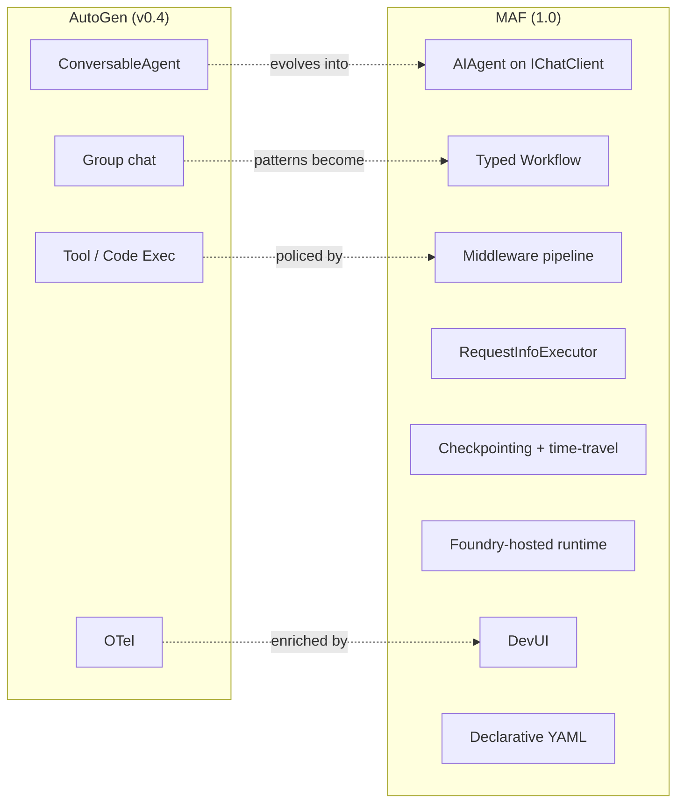

# AutoGen vs Microsoft Agent Framework

> A side-by-side comparison across every dimension that matters for an
> architecture decision, plus three honest "use the other one" cases.

## The headline comparison

| Dimension | AutoGen (v0.4) | Microsoft Agent Framework | Why it matters |
|---|---|---|---|
| **Primary goal** | Research-grade multi-agent platform | Production-grade unified agent SDK | Sets the priorities of every other dimension |
| **Target user** | Researchers, prototypers | Enterprise app teams, .NET / Python platform engineers | Drives docs, samples, governance |
| **Abstraction style** | Conversation as substrate | Typed graph workflow as substrate; conversation as a node type | Determines durability, replay, attribution |
| **Languages** | Python primary | Python + .NET parity | Whether the existing app stack can use it directly |
| **Common base class** | per-layer base (Core actor; AgentChat `BaseChatAgent`) | `AIAgent` (.NET) / `BaseAgent` (Python), one across the framework | Cross-cutting concerns work uniformly |
| **Provider abstraction** | per-client (e.g. `OpenAIChatCompletionClient`) | `Microsoft.Extensions.AI.IChatClient` (universal) | Provider parity, vendor flexibility |
| **Orchestration model** | GroupChat / Swarm / Magentic-One; speaker selection | Typed graph: sequential, concurrent, handoff, group chat, Magentic | Predictability, governance |
| **Agent lifecycle** | Construct & run | Construct, deploy (declarative YAML or code), version, host | Multi-team operability |
| **Tool execution** | Python functions in-process | Functions, MCP, OpenAPI, Foundry-hosted; passed through middleware | Security, audit, policy |
| **State management** | In-memory (`Memory` providers as extension) | `AgentThread` + `IMemory`; durable workflow checkpoints | Resume, replay, time-travel |
| **HITL** | `UserProxyAgent` (`human_input_mode`) | Typed `RequestInfoExecutor` with persisted RequestInfo / RespondInfo | Long-running approvals, durable inbox |
| **Observability** | OpenTelemetry (added in 0.4) | OpenTelemetry-native + DevUI debugger | MTTR, ops onboarding |
| **Evaluation** | AutoGen Bench | AF Labs evaluators + Foundry Eval; CI gates | Regression-safe shipping |
| **Safety / policy** | Up to the developer | Middleware pipeline + tool gateway pattern | Centralised enforcement |
| **Enterprise readiness** | Mid (community-led .NET, DIY governance) | High (LTS, identity, hosting, governance) | Production deployment |
| **Extensibility** | High (Core actors, custom GroupChat) | High (Executors, Edges, custom IChatClients) | Future-proofing |
| **Debuggability** | OTel + Studio session viewer | OTel + DevUI graph debugger | Faster incident triage |
| **Deployment model** | DIY (FastAPI / containers / k8s) | DIY *or* Foundry-hosted agents | Hosting cost & friction |
| **Governance** | Library-level (none) | Declarative agents, registry-friendly contracts | Multi-team scale |
| **Learning curve** | Conversation feels intuitive; production needs custom plumbing | Slightly higher upfront (workflows + middleware) but production-ready out of the box | TCO over the project lifetime |
| **Maturity (May 2026)** | v0.4.x stable; research lineage | GA 1.0, LTS commitment for core building blocks | Risk of API churn |
| **License** | MIT | MIT | Equal |
| **Best use cases** | Multi-agent research; novel orchestration patterns; code-execution-heavy demos | Enterprise agent platforms; production multi-agent flows; HITL workflows; Microsoft / .NET shops | Where each shines |

## Visual diff

## When to use AutoGen

1. **Multi-agent research.** Magentic-One, Swarm, novel speaker-selection
   experiments. The community's research traction is here.
2. **Code-execution-heavy demos.** AutoGen's `UserProxyAgent` +
   `CodeExecutor` makes code-as-action the most direct expression of the
   pattern.
3. **Tutorials, courses, and learning material.** A huge volume of public
   teaching content is built on AutoGen 0.2/0.4; if your goal is "learn
   the agent vocabulary," AutoGen is still the gentlest entry point.
4. **You don't need durability or .NET.** A research prototype that lives
   for a few weeks doesn't need typed workflows or Foundry hosting.

## When to use Microsoft Agent Framework

1. **Enterprise production.** You need typed workflows, durable
   checkpoints, native HITL, OTel, governance.
2. **.NET / Python parity.** Your stack is .NET-anchored or you need
   cross-language consistency.
3. **Microsoft cloud alignment.** Foundry hosting, App Insights,
   Entra/AAD, Foundry Eval, Foundry-backed memory.
4. **You expect to deploy and operate the system long-term.** The 1.0
   LTS commitment matters for risk planning.
5. **Multi-team agent platform.** Declarative manifests, middleware,
   registry-friendly contracts.
6. **Long-running flows with HITL.** Approval inboxes, multi-day
   approvals, escalation, and audit needs.

## When to use *neither* and build a thin platform layer

This is the case most senior architects under-discuss.

1. **Heavy regulatory environment.** When auditability, lineage, and
   policy enforcement need to be vendor-independent and crystal-clear.
   You may pick MAF as the *core* but add a thin "agent platform"
   wrapper that mints credentials, owns audit, and tracks lineage.
2. **You're a model lab, not a product team.** Direct OpenAI / Anthropic
   SDKs + your own glue may be lighter than either framework.
3. **Multi-cloud / multi-vendor by mandate.** Build a thin
   orchestration layer over multiple frameworks; let teams pick their
   poison.
4. **You're embedding agents in an existing app framework** (Spring,
   Rails, Django) and want zero opinion bleed. Use the LLM provider's
   SDK directly + a small in-house workflow primitive.

The honest truth: most teams that "build their own platform" end up
re-deriving MAF or LangGraph. So before you commit to that path, list
the *concrete* requirements your platform needs that MAF or LangGraph
genuinely doesn't have. Often the list is shorter than expected.

## "I'm migrating, where do my AutoGen concepts land?"

| AutoGen 0.4 concept | MAF equivalent |
|---|---|
| `AssistantAgent` | `ChatClientAgent` / `ChatAgent` |
| `UserProxyAgent` (`human_input_mode`) | `RequestInfoExecutor` (HITL) + Agent Harness (code exec) |
| `RoundRobinGroupChat` | `WorkflowBuilder` sequential pattern |
| `SelectorGroupChat` | MAF group-chat workflow pattern |
| `Swarm` | MAF handoff workflow pattern |
| `MagenticOneGroupChat` | MAF Magentic workflow pattern |
| `FunctionTool` | `AIFunction` / `@ai_function` |
| `CodeExecutor` | Agent Harness + MCP code-exec tools |
| OTel spans | OTel spans + DevUI |
| `MaxMessageTermination`, `TextMentionTermination` | Workflow termination + executor `is_complete` |

## Bottom-line statement

> **AutoGen is the research lineage, MAF is the production lineage. They
> share a parent (Microsoft) and most of a vocabulary. Pick AutoGen when
> the priority is "explore what an agent can do." Pick MAF when the
> priority is "build, operate, and govern agents that run for real users."**
