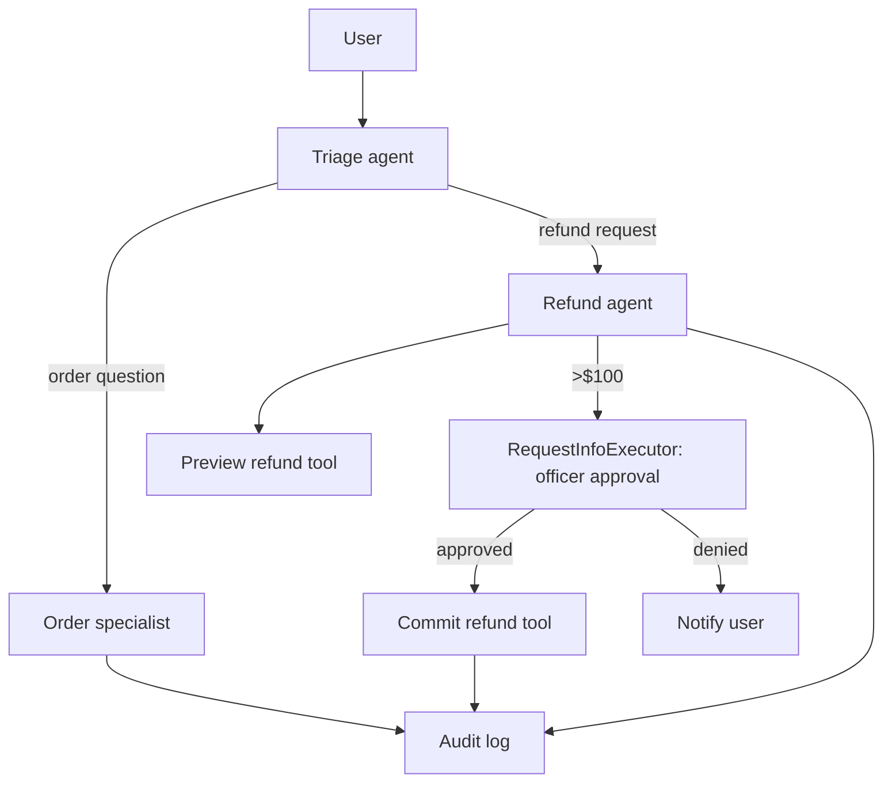
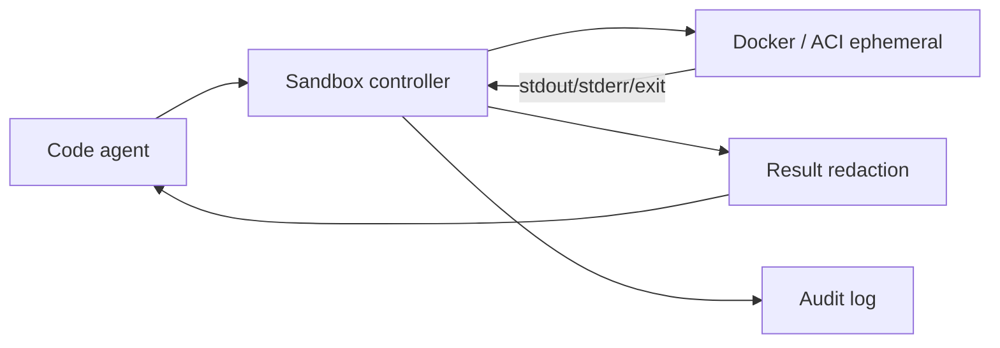
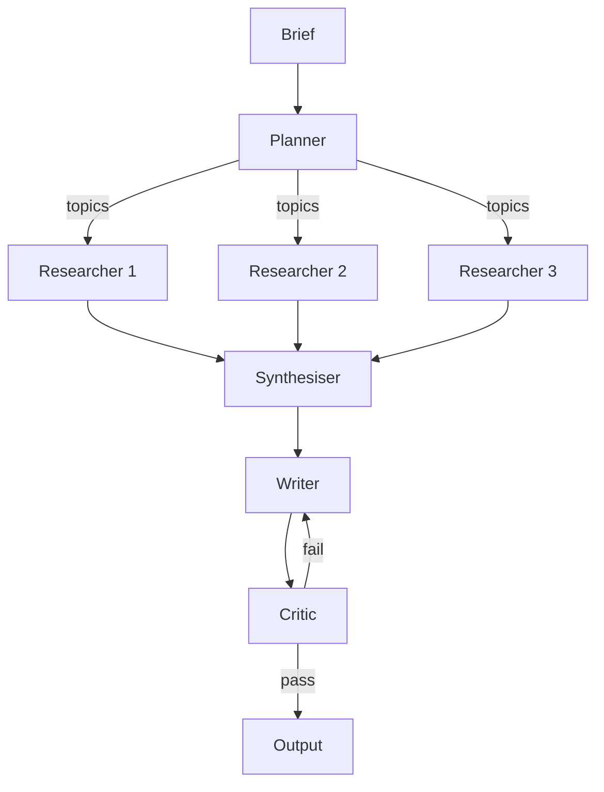
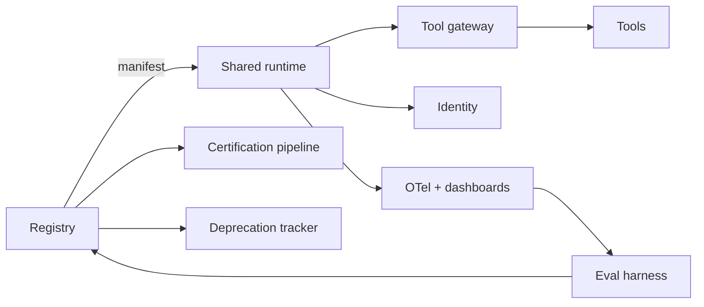

# Deep-dive scenarios

> Five realistic situations a senior architect actually faces. Each one
> is treated as a small case study with: situation, key decisions, what
> AutoGen-style would do, what MAF-style would do, common pitfalls,
> success metrics, and an interview-ready summary.

## Scenario 1 — Research prototype

**Situation.** A research team wants to test multi-agent collaboration on a
hypothesis. Time horizon: weeks. Audience: themselves. No production users.

**Why AutoGen-style works well.**

- Lowest time-to-first-experiment.
- The ergonomics fit researcher mental models.
- Magentic-One, Swarm, GroupChat patterns are first-class.
- AutoGen Bench gives programmatic scoring.

**What to watch out for.**

- Don't deploy to real users without re-architecting.
- Add OTel and a small golden set even in research; you'll need them
  at promotion time.
- Avoid hand-rolling persistence.

**When to stop and add structure.**

- Your prototype is being shown to customers.
- HITL approvals appear in the demo path.
- Anyone outside the team is depending on the agent.
- The eval set has more than 10 cases.

**MAF-style alternative.** Slightly more setup but graduates to
production cleanly. Pick this if you suspect "the prototype will
become real" within 2 months.

**Success metric.** Number of hypotheses tested per week, not time-to-prod.

**Interview-ready summary.**

> "For research, AutoGen's conversation ergonomics are still the
> fastest path. I'd add OTel and a small golden set early to make
> promotion to production cheap when the time comes."

## Scenario 2 — Enterprise customer support agent

**Situation.** A company wants a production support agent that calls
internal tools (lookup_order, refund, create_ticket), escalates to humans
above thresholds, and logs everything for audit.

**Why tool governance matters.** Refunds, tickets, and customer data are
side-effecting. Without auth, audit, and rate limits, a single
prompt-injection could exfiltrate data or trigger fraudulent refunds.

**Why audit logs matter.** Disputes (customer "I never asked for that
refund") require reconstruction. Regulators (PCI, GDPR) require
immutable trails.

**Why deterministic workflows matter.** Replays must produce the same
flow given the same inputs and tool outputs. Conversation-as-orchestration
makes that hard.

**Why MAF-style structure helps.**

- Typed handoff edges from triage → specialist.
- `RequestInfoExecutor` for refund-over-threshold approval.
- Tool gateway with auth + audit log.
- OTel + DevUI for incident response.
- Declarative manifest with eval set in CI.

**Architecture sketch.**

**Common pitfalls.**

- Letting the triage agent pick the next specialist via LLM (use typed
  edges).
- Putting `input()` for officer approval (use durable HITL).
- Logging args verbatim (redact PII, store hashes).

**Success metrics.** Resolution rate, escalation rate, refund accuracy,
HITL queue p95, $-per-thread, audit completeness.

**Interview-ready summary.**

> "I'd model this as a typed workflow: triage → typed handoff →
> specialist → tool calls behind a gateway → durable HITL on
> threshold. OTel everywhere. Refund actions are idempotent with
> operation IDs. Eval set covers happy path, abuse path, and edge
> cases."

## Scenario 3 — Code-generation agent

**Situation.** An agent that writes and executes code on behalf of a
developer.

**Why it's powerful.** Code is the most general action: data
manipulation, plotting, API calls, file edits. A single agent with a
strong Python interpreter can solve enormously varied tasks.

**Why it's risky.** Arbitrary RCE if not sandboxed. Resource exhaustion.
Prompt-injection that emits exfiltration code.

**Required controls.**

- **Sandbox.** Docker / ACI / ephemeral Jupyter; no host filesystem; no
  egress to internal networks; resource limits.
- **Review.** Auto-approve simple ops; human review for risky
  ops (file writes, network calls, package installs).
- **Output redaction.** Strip secrets and tokens; consider returning
  hashes for cross-checks.
- **Cost limits.** Token + container time per run.
- **Audit.** Every code block + execution result + decision is logged.

**Sandbox design (sketch).**

**Review path.**

- Static taint check (forbidden imports / built-ins).
- Optional dry-run mode where the LLM proposes code but doesn't
  execute.
- HITL approval for policies the agent can't auto-clear.

**Why MAF Agent Harness fits.** Agent Harness gives a managed
shell + filesystem + messaging loop with a sandbox model — closer to
production than rolling your own.

**Interview-ready summary.**

> "Treat code-execution as a sandboxed RPC, not as `exec()`. Sandbox
> with no host FS / no internal egress; resource caps; redaction; per-run
> cost limit; audit log. Use a code-exec tool that is policy-fronted,
> not an in-process REPL."

## Scenario 4 — Multi-agent business workflow

**Situation.** Several agents collaborate across planning, retrieval,
execution, and validation — for example, a marketing campaign planner.

**Failure modes.**

- Coordination loops (agent A waits for B; B waits for A).
- Lost context across handoffs.
- Cost spike from over-eager retrieval.
- Untraceable failures across 5+ agents.

**State management.** Shared workflow state (in MAF, the workflow
context; in LangGraph, the StateGraph state) is the single source of
truth. Agents read / append, never own.

**Observability.** OTel spans per agent / executor; visualise as a
graph (DevUI / LangSmith); alert on long-running paths.

**Evaluation.** Workflow-level golden tasks: "given a brief, did the
workflow produce a campaign that meets the rubric (audience, channels,
KPIs, draft creatives)?" LLM-judge with rubric.

**Cost / latency trade-offs.**

- Caching deterministic retrievals.
- Parallel fan-out where independent.
- Smaller / cheaper models for routine sub-tasks.
- Budgets per workflow run.

**Architecture sketch.**

**Interview-ready summary.**

> "Model as a typed workflow with parallel fan-out + fan-in. State is
> shared in the workflow context; OTel everywhere; one critic loop
> with a hard cap. Golden tasks measure end-to-end quality. Per-run
> budget + auto-throttle."

## Scenario 5 — Enterprise agent marketplace

**Situation.** A large company wants reusable agents across teams: a
research agent, a support triage, a finance summariser, a code-review
helper, etc.

**What you need.**

- **Registry.** All agents discoverable; manifests; ownership;
  versions; deprecation; eval status.
- **Ownership.** Each agent has a named owner team + on-call alias.
- **Versioning.** Semantic versioning; threads pin a version; canary
  rollouts.
- **Certification.** A repeatable "production-ready" review: eval pass
  rate, HITL durability, audit logging, cost budget, on-call.
- **Deprecation.** Sunset date + replacement pointer; usage analytics
  drive prioritisation.
- **Usage analytics.** Per-agent / per-team consumption, cost, errors.
- **Governance.** Tool allow-lists per agent; cross-team policies;
  per-tenant data classes.

**Architecture sketch.**

**Common pitfalls.**

- Registry entries that don't match deployed reality.
- "Approved" agents that haven't been re-evaluated in 6 months.
- Cross-team incidents with no clear owner.
- Tools that bypass the gateway "for performance."

**Success metrics.** % of production agents with current manifests; %
with current evals; mean time to deprecate; cross-team adoption rate;
incident MTTR.

**Interview-ready summary.**

> "An agent marketplace is a registry + manifests + tool gateway +
> eval harness + governance. The runtime (MAF / LangGraph) is the
> easy part. The hard parts are ownership, versioning, certification,
> and deprecation — they require investment in process, not just code."

## Cross-scenario lessons

1. **Typed workflows beat free conversation** in 4 of 5 scenarios.
2. **Tool gateways pay for themselves** the first time you have an
   incident across two agents using the same tool.
3. **Eval gates** prevent more incidents than any other practice.
4. **HITL durability** is required by half of real workflows.
5. **Telemetry is the precondition** to all of the above.
