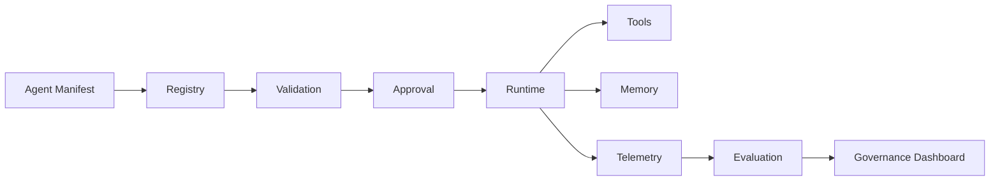
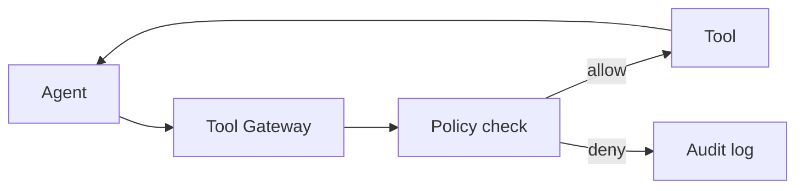
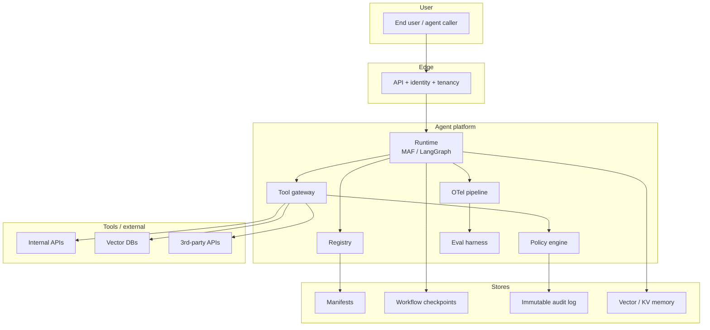

# Enterprise agent platform lessons

> If you're building (or buying) an internal agent platform on top of MAF
> (or LangGraph, or any framework), these are the lessons that show up
> *every* time. Most of them are not framework-specific.

## The single most important shift

> **Enterprise platforms separate the *agent* (a unit of work) from the
> *runtime* (the system that hosts and governs it).** AutoGen-style code
> blurs the two. Production platforms must un-blur them.



## Lesson 1 — Separate experimentation from production runtime

- **Experimentation runtime:** wide-open, every model available, no
  approvals, no audit. Used by researchers and prompt engineers.
- **Production runtime:** locked-down, auditable, identity-bound,
  policy-enforced, observable.

Don't try to make one runtime serve both. Document the path from one to
the other (promotion criteria: golden-set pass, owner sign-off,
manifest review).

## Lesson 2 — Manifest-first agents

A manifest is a YAML / JSON document describing an agent: name, owner,
version, instructions, tools, memory, eval set, telemetry tags. Every
agent in production has one. MAF's declarative agents are a building
block; you'll usually wrap them with org-specific metadata.

```yaml
# example agent manifest
name: support-triage
version: 2.4.0
owner: support-platform
description: Routes inbound support requests to the right specialist.
chat_client: foundry
model: gpt-4o
instructions: ./instructions.md
tools:
  - kb-search@1.2
  - ticket-create@1.0
memory:
  provider: foundry
  scope: thread
eval_set: ./evals/support-triage-golden.yaml
telemetry:
  service: support
  cost_center: customer-success
```

## Lesson 3 — Agent registry

A simple service over the manifests:

- List agents.
- Search by tag, owner, model, tool.
- Show version history and changelog.
- Track ownership and on-call.
- Track deprecation status.

Without a registry, you don't know what you have, who owns it, or who
can change it. The cost of building this is small; the cost of not
having it is enormous at multi-team scale.

## Lesson 4 — Track ownership and lifecycle

States every agent moves through:

```text
draft → in-review → approved → deployed → deprecated → retired
```

Promotion between states requires: passing evals, manifest review,
owner sign-off. Retirement requires: traffic = 0 + 30-day grace period.

## Lesson 5 — Enforce policies *before* tool execution

A tool gateway pattern:



The gateway owns:

- Auth (who can call this tool right now).
- Rate limiting per user / tenant.
- PII / data-class filters.
- Audit log (immutable).
- Metrics (call rate, error rate, latency, cost).

In MAF, you can implement many of these as middleware around the
tool call. For shared tools across many agents, a separate gateway
service is often clearer.

## Lesson 6 — Add evaluation gates

CI:

- On every PR that touches an agent, run its golden set.
- Block merge if pass rate drops below threshold.
- Surface diffs against the prior version.

Production:

- Sample N% of production traces; LLM-judge them on a rubric.
- Alert on drift.

The evaluation discipline is the single biggest determinant of
*whether you can iterate safely*.

## Lesson 7 — Observability from day one

OTel spans for everything, with GenAI semantic-conventions attributes:

- `agent.run` (thread_id, user_id, agent_name, agent_version)
- `llm.call` (model, prompt_tokens, completion_tokens, cost)
- `tool.call` (tool_name, args_redacted, latency, error)
- `executor` (workflow_id, executor_name, input_type, output_type)
- `request_info` (RequestInfo type, fulfilled_at)

Dashboards: error rate, p95 latency, cost-per-thread, HITL queue depth,
agent-completion rate, tool-error rate.

Alerts: regression on golden set, HITL SLA breach, cost spike,
abnormal speaker-selection patterns.

## Lesson 8 — Design for auditability

Every agent run must be reproducible:

- Persist inputs, outputs, tool calls, model + prompt versions.
- Persist the manifest hash used.
- Persist HITL decisions.
- Make this immutable (append-only log).

Auditability is the difference between "we'll get back to you in two
days" and "we know exactly what happened in 30 seconds" when a
regulator asks.

## Lesson 9 — Keep orchestration explicit

Avoid hidden orchestration via LLM-picked speakers when you can. Use
typed handoffs. When you must use LLM selection (genuinely
open-ended), log the selection prompt + selection rationale.

## Lesson 10 — Support human approval workflows

Common shapes:

- **Single-step approval.** "Approve refund > $100."
- **Multi-step approval.** Manager → Director → CFO.
- **Time-boxed escalation.** If officer doesn't respond in 24h, escalate.
- **Parallel approval.** N-of-M approvers.

All of these are durable workflows with `RequestInfoExecutor`-shaped
nodes. Build them once as platform components, not ad-hoc per agent.

## Lesson 11 — Versioning and rollback

- Semantic versioning on the manifest.
- Pinning: a thread keeps the manifest version it started with.
- Canary: roll out new versions to N% of traffic first.
- Rollback: a single-button promotion of an older approved version.

## Lesson 12 — Cost and latency tracking

Per-agent and per-thread metrics:

- $-per-thread (and $-per-user-per-day).
- p95 latency.
- Token consumption.
- Tool-call rate.

Make these visible to agent owners. Set budgets. Auto-throttle when
budgets exceed.

## Lesson 13 — Design for multi-team usage

The "shared platform" patterns:

- Per-team namespaces in the registry.
- Shared identity & secrets store.
- Shared eval harness.
- Shared telemetry pipeline.
- Self-service onboarding (a team can ship a new agent without help).

## Reference architecture



## Build vs buy

| Component | Build | Buy / use OSS |
|---|---|---|
| Agent runtime | rarely | MAF / LangGraph / Foundry |
| Registry | small one yes; large one buy | LangGraph Platform / custom |
| Tool gateway | usually build | n/a (your APIs) |
| Policy engine | small one build | OPA / Rego / Cedar |
| Eval harness | thin layer build | LangSmith / Foundry Eval / Arize |
| Telemetry | use existing OTel + dashboards | Datadog / App Insights / Honeycomb / Phoenix |
| Audit log | build (custom) | append-only DB or storage |
| Identity | use platform | Entra / Okta / Auth0 |

Most teams build *only* the registry, the policy engine wiring, and
the audit log. Everything else they consume.

## A simple maturity ladder

Five levels — give yourself a score:

1. **Toy** — single agent, single team, no eval, no telemetry.
2. **Operational** — OTel, golden-set eval, single-team prod usage.
3. **Multi-team** — registry, manifest review, shared tools / memory.
4. **Governed** — tool gateway, policy engine, immutable audit log,
   approval workflows, HITL durable inboxes.
5. **Strategic** — multi-cloud / multi-vendor, evaluation as a service,
   self-service onboarding, autonomous canary + rollback.

Most enterprises are at 1–2 today and aiming for 3–4. Level 5 is
genuinely rare.
