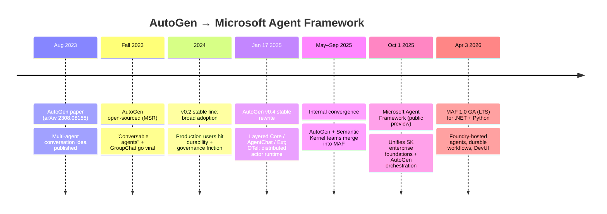
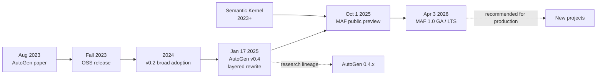

# Evolution timeline

> Phase-by-phase: what changed, why, what pressure forced it, and what
> generalisable lesson sits underneath. Verified dates are cited; everything
> else is marked **(inference)**.

## Visual timeline

## Phase 1 — Early AutoGen (2023)

**What it was.** A Microsoft Research project introducing a new programming
model: *conversable agents* that exchange natural-language messages to solve
tasks together, with humans optionally in the loop.[^paper]

**What changed.**

- First-class abstractions: `AssistantAgent`, `UserProxyAgent`, GroupChat.
- LLM-driven tool/function calling baked into the agent abstraction.
- Code execution as a built-in agent capability (Python interpreter, Docker).
- Made multi-agent prototypes possible in <100 lines of Python.

**Why it changed.** Before AutoGen, "agent" patterns were ad-hoc Python loops
on top of LangChain or raw OpenAI calls. AutoGen unified the pattern.

**Engineering pressure.** Researchers wanted a quick way to test multi-agent
collaboration hypotheses without re-implementing message-passing every time.

**Lesson learned.** A great research framework optimises for *time-to-first-experiment*,
not for production properties. That's the right priority for the moment;
the cost is paid later.

## Phase 2 — AutoGen growth (2024)

**What it was.** AutoGen broke out of MSR. AutoGen Studio appeared as a
low-code authoring UI. Magentic-One arrived as a flagship orchestration pattern.
Companies started shipping production AutoGen apps. The 0.2 line became the
de-facto stable.

**What changed.**

- More agent variants and orchestration patterns.
- Code-execution sandboxes hardened.
- An ecosystem of integrations grew (vector stores, tools, memory).
- The first production deployments surfaced friction.

**Why it changed.** Real users discovered real problems. Multi-agent traces
were hard to debug. Long-running workflows had no checkpointing. State
management was implicit. Governance was bolted on. **(inference)** these
themes appear repeatedly in 0.2-era issues, blog posts, and migration write-ups.

**Engineering pressure.** Production users wanted reliability features that
the conversation-centric model didn't natively provide.

**Lesson learned.** When a research framework's user base flips from researcher-heavy
to engineer-heavy, the framework either re-architects or fragments.

## Phase 3 — Roadblocks and the 0.4 rewrite (late 2024 – Jan 2025)

**What it was.** AutoGen's maintainers shipped a complete redesign on
**January 17, 2025**.[^v04] The core abstractions moved from a flat Python
class hierarchy to a **layered architecture**:

1. **`autogen-core`** — async, event-driven actor runtime; addressable agents;
   single-process or distributed (gRPC).
2. **`autogen-agentchat`** — high-level conversational API (the v0.2-style
   ergonomics, redesigned).
3. **`autogen-ext`** — model clients, code executors, tools, integrations.

**What changed (vs 0.2):**

- Agents communicate by typed async messages instead of synchronous Python calls.
- Built-in OpenTelemetry traces.
- Distributed runtime for cross-process actors.
- Cleaner extension points; AutoGen Studio rebuilt on AgentChat.

**Why it changed.** v0.2 had become *too easy to misuse* in production. The
0.4 architecture made the actor model explicit and gave operators a runtime
they could observe.

**Engineering pressure.** Scale (more agents, more long-running tasks),
debuggability (multi-agent traces in distributed deployments), and governance.

**Lesson learned.** Re-architectures are expensive *and necessary*. The
0.2→0.4 migration was a hard sell to existing users, but without it, AutoGen
would have ossified.

## Phase 4 — Convergence and Microsoft Agent Framework (2025)

**What it was.** On **October 1, 2025**, Microsoft introduced the
**Microsoft Agent Framework** in public preview, formally unifying the
enterprise-ready foundations of **Semantic Kernel** with the orchestration
ideas pioneered in **AutoGen**.[^maf-preview] On **April 3, 2026**, MAF
shipped **GA 1.0** with .NET + Python parity and an LTS commitment for the
core building blocks.[^maf-ga]

**What changed.**

- One framework instead of two competing-ish ones (SK and AutoGen).
- Production-grade primitives that AutoGen 0.4 lacked:
  - **Typed graph workflows** (Sequential / Concurrent / Handoff / Group Chat / Magentic).
  - **Durable checkpointing** with resume and time-travel.
  - **First-class HITL** via `RequestInfoExecutor`.
  - **Middleware** pipelines (telemetry, retries, redaction, security).[^middleware]
  - **Foundry-hosted agents** — managed runtime, autoscale, identity.
  - **OpenTelemetry-native** with a DevUI debugger.
  - **Declarative YAML agents** for review and governance.
- Built on `Microsoft.Extensions.AI.IChatClient`,[^iChatClient] keeping the
  framework provider-agnostic (Foundry, Azure OpenAI, OpenAI, Anthropic,
  Bedrock, Ollama, GitHub Copilot SDK, Claude Code SDK).

**Why it changed.** Two parallel frameworks (SK + AutoGen) confused
customers; both teams were converging on similar enterprise needs. Merging
them produced a single, opinionated, production-ready stack.

**Engineering pressure.** Enterprise customers asking for one framework with
.NET + Python parity, durability, governance, and Microsoft commercial
support.

**Lesson learned.** Successful research frameworks usually become *inputs*
to the production framework that follows. AutoGen wasn't replaced — it was
*absorbed* and extended.

## Phase 5 — What's next (May 2026 onward)

**(inference)** Forward signals from the public roadmap and devblogs suggest:

- DevUI, Foundry-hosted agents, evaluations, AG-UI / CopilotKit / ChatKit
  adapters mature out of preview.
- Reusable Skills, GitHub Copilot SDK, and Claude Code SDK integrations
  deepen.
- Agent Harness (shell / file / messaging loops) becomes standard for
  coding-style agents.
- AutoGen continues as a research lineage; production users on AutoGen are
  guided to MAF via the [official migration guide](https://learn.microsoft.com/en-us/agent-framework/migration-guide/from-autogen/).

## One-page model

## Source-of-truth dates

| Date | Event | Source |
|---|---|---|
| Aug 2023 | AutoGen paper on arXiv | arXiv:2308.08155 |
| Fall 2023 | AutoGen OSS released | MSR project page |
| Jan 17, 2025 | AutoGen v0.4 stable | Microsoft devblogs / GitHub releases |
| Oct 1, 2025 | MAF public preview | Microsoft Azure Blog |
| Apr 3, 2026 | MAF 1.0 GA (.NET + Python, LTS) | Microsoft devblogs / Visual Studio Magazine |

---

[^paper]: Q. Wu, G. Bansal, J. Zhang, et al. "AutoGen: Enabling Next-Gen LLM Applications via Multi-Agent Conversation," arXiv:2308.08155, August 2023.
[^v04]: "AutoGen reimagined: Launching AutoGen 0.4," Microsoft devblogs, January 14, 2025; AutoGen v0.4 stable release announcement, January 17, 2025.
[^maf-preview]: "Introducing Microsoft Agent Framework," Microsoft Azure Blog, October 1, 2025.
[^maf-ga]: "Microsoft Agent Framework Version 1.0," Microsoft devblogs, April 3, 2026.
[^middleware]: Microsoft Agent Framework migration guide explicitly notes: "Agent Framework introduces middleware capabilities that AutoGen lacks."
[^iChatClient]: ".NET Blog: Microsoft Agent Framework — Building Blocks for AI": MAF "builds directly on top of `IChatClient`."
