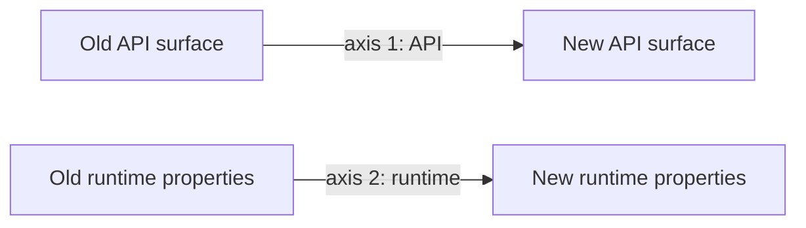

# Migrating from AutoGen-style systems to Agent Framework

> Microsoft publishes an [official AutoGen → MAF migration
> guide](https://learn.microsoft.com/en-us/agent-framework/migration-guide/from-autogen/).
> This page is *complementary*: a strategic / architectural overview from a
> senior architect's perspective, focused on **how to think about the move**,
> not just the API mapping.

## A two-axis migration

Every migration moves on two axes:



- **Axis 1 (API):** rewrite from `AssistantAgent` to `ChatClientAgent`, etc.
- **Axis 2 (runtime properties):** add typed workflow, durability,
  middleware, HITL primitives, OTel.

The mistake teams make: they finish axis 1 and stop. The wins are mostly
on axis 2.

## Phase 0 — Inventory (the most important phase)

Before writing any new code, build the inventory:

1. **All existing agents.** Name, owner, file path, dependencies.
2. **All tools each agent can call.** Name, side effects (read / write /
   external), permissions required.
3. **All conversation patterns in use.** Round-robin? Selector? Custom?
4. **All state dependencies.** What persists across runs? Where?
5. **All HITL touch points.** Who approves what? On what timeline?
6. **All termination conditions.** What stops each chat?
7. **All eval signals.** What "good" means for each agent.
8. **All deployment targets.** Where each agent runs today.

Most migrations underestimate the inventory. Budget 1 day per ~10 agents.

## Phase 1 — Define agent contracts

For each agent, write a *contract*:

- Name, version, owner.
- Input schema (typed).
- Output schema (typed).
- Tools allowed.
- Memory allowed.
- Eval set (golden tasks).
- Telemetry expectations.

This produces something close to a MAF declarative YAML manifest. Even if
you don't adopt declarative agents, the *exercise* of writing the contract
exposes hidden assumptions.

## Phase 2 — Re-express orchestration as workflow

The biggest mental shift: from *conversations* to *typed graphs*.

### Pattern map

| AutoGen pattern | MAF workflow pattern |
|---|---|
| Two-agent chat (planner + worker) | Sequential workflow with two executors |
| `RoundRobinGroupChat` | Sequential workflow with N executors in order |
| `SelectorGroupChat` | MAF group-chat workflow pattern |
| `Swarm` | MAF handoff workflow pattern |
| `MagenticOneGroupChat` | MAF Magentic workflow pattern |
| Custom `BaseGroupChat` | Custom workflow with handoff edges |

### What you gain in the rewrite

- **Typed inputs/outputs** between executors.
- **Checkpointing** at each step.
- **Resume** from any checkpoint.
- **Time-travel** for debugging.
- **Streaming events** to a host (DevUI / web UI).
- **Sub-workflows** for composability.

### What you give up

- Some emergent flexibility of "let agents talk and see what happens."
  You can recover it with a `SelectorGroupChat`-style MAF workflow node
  for the genuinely open part.

## Phase 3 — Add HITL the right way

For each AutoGen `UserProxyAgent` or human-input touchpoint:

1. Decide if the human is **in-the-loop** (synchronous) or
   **on-the-loop** (asynchronous, durable).
2. If on-the-loop, replace with a `RequestInfoExecutor`-style step.
3. Wire the inbox: UI form, Slack, ticket queue.
4. Define SLA + escalation policy.
5. Persist decisions for audit.

## Phase 4 — Add middleware

Pipelines you should ship before re-enabling production:

- **Telemetry:** OTel spans for `agent.run`, `llm.call`, `tool.call`.
- **PII redaction:** before LLM call; after tool result.
- **Auth:** token-bound to the user / tenant; refused if scope mismatch.
- **Retries:** for transient failures only; idempotency keys for tool
  calls.
- **Cost / token guard:** abort if budget exceeded.

In MAF, these slot into the middleware pipeline. In LangGraph, they live
in graph nodes wrapping the LLM/tool call. Either way, *make them
framework-level, not per-agent*.

## Phase 5 — Add evaluation

For each agent contract, define:

- A golden set (≥ 30 tasks, ideally 100+).
- Pass/fail criteria (programmatic where possible; LLM-judge where not).
- A regression script that runs on every PR.
- Online sampled evals on production traces.

Without this, you can't safely change a prompt.

## Phase 6 — Add observability and policy from day one

- OTel exporter to your existing backend (App Insights, Datadog,
  Langfuse, Phoenix).
- Dashboards: error rate, p95 latency, $-per-thread, tool error rate,
  HITL queue depth, agent-completion rate.
- Alerts: regression on golden set, HITL SLA breach, cost spike.

## Phase 7 — Cut over with a kill switch

- Run AutoGen and MAF *in parallel* on the same input for 1–2 weeks.
- Diff outputs; fix divergences.
- Switch traffic gradually behind a feature flag.
- Keep a rollback path (original AutoGen agent + thread state) for ≥ 30
  days.

## Phase 8 — Decommission

After steady-state on MAF:

- Tag the AutoGen revision in git.
- Archive the AutoGen runtime config.
- Update docs / runbooks.
- Schedule a learning review with the team.

## Migration checklist (copy into your tracker)

```text
[ ] Inventory all existing agents
[ ] Inventory all tools each agent can call
[ ] Define ownership for each agent
[ ] Write input/output contracts (schemas)
[ ] Define evaluation metrics + golden set
[ ] Define safety policies (PII, auth, rate limits)
[ ] Define logging and tracing (OTel exporter)
[ ] Replace UserProxyAgent HITL with RequestInfoExecutor (or equivalent)
[ ] Re-express conversation patterns as typed workflows
[ ] Add middleware for telemetry, redaction, auth, retries, cost
[ ] Wire DevUI for local debugging
[ ] Stand up CI evals (golden set on every PR)
[ ] Run AutoGen and MAF in parallel; diff outputs
[ ] Define rollback process
[ ] Cut over behind a feature flag
[ ] Archive AutoGen runtime + tag git
[ ] Schedule a learning review
```

## Migration anti-patterns to avoid

1. **"We'll just rewrite the agents and ship."** That's axis-1-only;
   you'll miss the runtime wins.
2. **"We'll add OTel later."** Add it before cutover; you'll need it for
   the cutover diff.
3. **"We'll keep the same prompts."** Use the migration as a chance to
   tighten prompts; check golden-set regressions.
4. **"We'll skip the inventory; the team knows what we have."** They
   don't. Always.
5. **"We'll run on a single LLM provider; vendor parity isn't a
   priority."** It will be in 6 months when prices or capabilities
   change.
6. **"We'll let the LLM keep picking next speakers."** Default to
   typed handoff; opt into LLM selection only where genuinely needed.

## "Should we migrate at all?" decision check

Migrate to MAF if any of these are true:

- You're hitting AutoGen's durability or HITL limits.
- You need .NET parity.
- You want a managed runtime (Foundry-hosted).
- You're scaling beyond a single team and need governance.
- You want LTS API stability.

Stay on AutoGen if all of these are true:

- You're doing research / prototyping.
- Python-only and short-lived.
- No need for durable HITL.
- You don't have OTel / governance pain yet.

## Quote-ready elevator pitch for the migration

> "We're migrating because *conversation-as-orchestration* is the wrong
> contract for production. We need typed steps, durable checkpoints,
> first-class HITL, and one telemetry surface. MAF gives us all four out
> of the box and lets us keep the agent ergonomics we like from AutoGen.
> The plan is inventory → contracts → workflow rewrite → middleware →
> evals → dual-run cutover → decommission, behind a feature flag and a
> rollback path. Net cost: ~6 weeks for ~20 agents; net benefit:
> measurable MTTR reduction and a path to multi-team scale."
