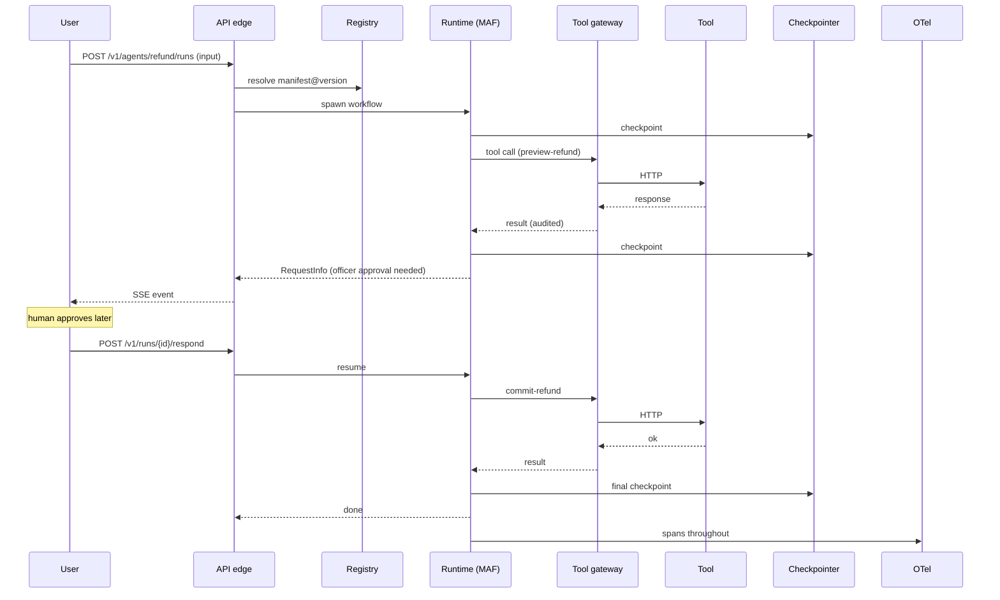
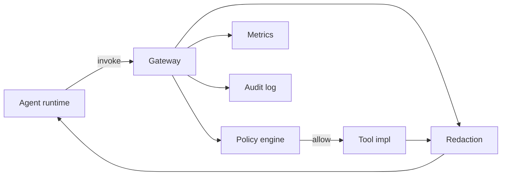
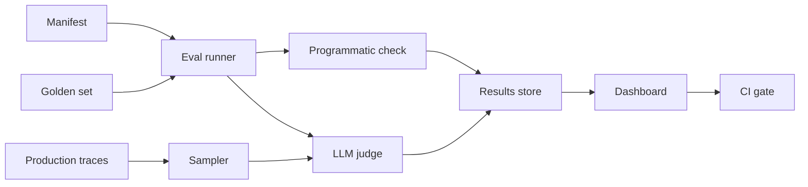

# System design lessons

> Six interview-grade system-design exercises. For each: requirements, APIs,
> data model, architecture, workflow, failure modes, scaling, security,
> monitoring, trade-offs, follow-up questions, and strong answers.
>
> The design choices reflect lessons from the AutoGen → MAF evolution.

## 1. Design an enterprise agent platform

### Requirements

- Functional: 100s of agents, 100s of tools, multi-team. Agents are LLM-driven,
  may call tools, may invoke sub-workflows, may pause for human input.
- Non-functional: p95 latency for short agents < 3s; HITL flows can be days
  long; durable; auditable; multi-region; SOC 2 Type II.

### APIs (HTTP)

```text
POST /v1/agents/{name}/runs           # start an agent run
GET  /v1/runs/{id}                     # poll status
GET  /v1/runs/{id}/events              # SSE stream
POST /v1/runs/{id}/respond             # respond to a RequestInfo (HITL)
POST /v1/agents                        # register manifest
GET  /v1/agents                        # list with filters
PATCH /v1/agents/{name}                # update manifest (review required)
POST /v1/evals/{agent}/run             # run eval set on demand
```

### Data model

| Entity | Fields |
|---|---|
| AgentManifest | name, version, owner, instructions, tools[], memory, eval_set, telemetry, status |
| Run | id, agent, version, user, tenant, started_at, status, parent_run_id |
| Checkpoint | run_id, step, state_blob, created_at |
| RequestInfo | run_id, kind, payload, created_at, fulfilled_at, decision |
| AuditEvent | run_id, actor, action, payload, hash, timestamp |
| EvalRun | agent, version, golden_set, results, started_at |

### Architecture

See [`enterprise-agent-platform-lessons.md`](enterprise-agent-platform-lessons.md#reference-architecture).

### Workflow (a single agent run)



### Failure modes & responses

| Failure | Response |
|---|---|
| LLM provider 5xx | retry with backoff; failover to secondary provider |
| Tool 5xx | retry with idempotency key; record audit; circuit-break on threshold |
| Workflow worker crash | resume from last checkpoint |
| HITL SLA breach | escalate; emit alert; auto-cancel after timeout |
| Cost cap exceeded | abort + audit; surface to owner |
| Selector loop | termination cap + alert; replace with deterministic handoff |

### Scaling

- Stateless API edge (horizontal autoscale).
- Workflow workers (autoscale by queue depth).
- Postgres for checkpoints (multi-AZ); S3/Blob for large state blobs.
- Per-tenant rate limits and quotas.

### Security

- Entra/AAD for user identity; per-tenant token scoping.
- Per-tool allow-list per agent in the manifest.
- Sandboxed code execution (containers / ACI).
- PII redaction middleware before LLM calls.
- Append-only audit log (e.g. WORM blob storage).

### Monitoring

- p95 latency per agent.
- Error rate per agent / per tool.
- Cost-per-thread; alarming on budgets.
- HITL queue depth and SLA.
- Eval pass rate trend.

### Trade-offs

- *Manifest review* slows shipping but prevents regressions.
- *Foundry-hosted runtime* simplifies ops but adds vendor coupling.
- *Append-only audit* costs storage but is non-negotiable for compliance.

### Follow-ups

- *How do you handle a blast-radius regression?* Canary new manifest
  versions to 5%; auto-rollback on KPI dip.
- *How do you do per-tenant data residency?* Separate storage and
  workflow workers per region; route by tenant claim.
- *How do you debug a cross-team flow?* `parent_run_id` chains; OTel
  trace; DevUI replay.

## 2. Design an agent registry

### Requirements

- Source of truth for all agents; supports versions, owners, tags, search.
- Manifest review workflow.
- Read-heavy.

### Data model

```text
agents(name PK, latest_version)
agent_versions(name, version PK, manifest_blob, status, created_by, created_at, eval_run_id)
owners(agent_name, team, on_call_alias)
tags(agent_name, tag)
deprecations(agent_name, replacement, sunset_at)
```

### APIs

```text
POST   /agents/{name}/versions
GET    /agents?owner=&tag=&status=
GET    /agents/{name}
GET    /agents/{name}/versions/{ver}
POST   /agents/{name}/versions/{ver}/promote
POST   /agents/{name}/deprecate
```

### Architecture

A small service over Postgres + Blob for manifest text + a CI hook.

### Workflow

1. Author writes manifest YAML.
2. PR triggers eval run; result attached to version.
3. Reviewer approves; status flips `in-review` → `approved`.
4. Promote to `deployed`; thread routing rules pick it up.

### Failure modes

- Two simultaneous version promotions: optimistic concurrency on
  `latest_version`.
- Eval flake: require N consecutive passes before promotion.

### Trade-offs

- Build vs buy: at small scale, a Git repo + GitHub Actions is enough.
  A real service makes sense at multi-team scale.

## 3. Design a tool execution gateway

### Requirements

- Single point that mediates agent → external tool calls.
- AuthZ, audit, redaction, rate limit, idempotency.

### APIs

```text
POST /tools/{name}/invoke   # body: args, agent_run_id, idempotency_key
```

### Architecture



### Data model

`audit(run_id, tool, args_hash, args_redacted, response_hash, status, ts, actor)`.

### Failure modes

- Tool 5xx: retry on idempotency key; circuit break.
- Policy 5xx: fail-closed (deny call) with explicit error.

### Scaling

- Stateless; horizontal scale; async per-tool worker queues for
  long-running tools.

### Security

- mTLS between agent runtime and gateway.
- Tool-specific signing keys.
- Args / response redaction with deterministic hashes for cross-checking.

### Trade-offs

- Adds a hop and ~5–20ms latency.
- Centralises ops burden but yields one place to enforce policy.

## 4. Design an evaluation system for agents

### Requirements

- Run eval sets on demand and on every PR.
- Mix of programmatic and LLM-judge.
- Replay production traces against new versions.

### Architecture



### Data model

`eval_runs(id, agent, version, golden_set_id, started_at, finished_at, summary)`
`eval_cases(run_id, case_id, expected, actual, score, passed)`

### Failure modes

- LLM-judge bias: rotate judges; calibrate against humans.
- Flaky cases: retry N times; mark flaky cases for review.

### Trade-offs

- Programmatic checks are deterministic but limited.
- LLM-judge is flexible but stochastic; calibrate.

## 5. Design observability for multi-agent systems

### Requirements

- See, debug, and alert on multi-agent flows end-to-end.

### Approach

- Use OTel GenAI semantic conventions consistently.
- Spans: `agent.run`, `llm.call`, `tool.call`, `executor`,
  `workflow.event`, `request_info`.
- Attributes: model, tokens, cost, args_redacted, agent_name,
  workflow_id, parent_run_id.
- Dashboards: error rate, p95 latency, $-per-thread, HITL queue depth,
  agent-completion rate, eval pass rate, speaker-selection histogram.
- Alerts: regression on golden, HITL SLA breach, cost spike.

### Trade-offs

- Trace data volume is large; sample wisely (head + tail).
- Redacting args is expensive; pre-compute hashes for joins.

## 6. Design a migration from AutoGen prototypes to production agents

### Requirements

- Move N agents off AutoGen onto MAF without downtime.
- Behaviour parity (within tolerance) on golden tasks.
- Rollback path.

### Approach

Follow the [migration thinking](migration-thinking.md) phases. Specifically:

1. Build the inventory.
2. Write contracts.
3. Re-express orchestration as workflow.
4. Add HITL primitives.
5. Add middleware.
6. Add evals.
7. Wire OTel + DevUI.
8. Run dual-stack for 1-2 weeks.
9. Cutover behind a feature flag.
10. Decommission.

### Failure modes

- Behaviour drift on subtle prompt changes — mitigate with a wide
  golden set and dual-running.
- HITL inboxes fill faster than expected — mitigate with SLA + escalation.
- Cost spike — mitigate with budgets + per-thread caps.

## Strong follow-up answers (interview gold)

- *Why do you persist checkpoints in Postgres rather than Redis?*
  Durability + cross-AZ replication; chat-thread state isn't
  performance-critical relative to LLM latency, so the trade-off
  favours durability.
- *Why a tool gateway vs middleware?* Middleware is in-process to the
  agent runtime; a gateway is out-of-process and shared across runtimes
  (Python + .NET + future). For shared tools, the gateway is the
  cleaner boundary; for runtime-private concerns (telemetry,
  redaction), middleware suffices.
- *How do you avoid LangGraph / MAF lock-in?* Define your own contract
  layer at the top (REST + manifests). Keep both runtimes substitutable.
  In practice, vendor lock-in to MAF or LangGraph is acceptable; lock-in
  to a single LLM provider is not.
- *Why not put HITL on a sync `input()` call?* Because real HITL is
  async, durable, auditable, and SLA-bound. `input()` matches none of
  those.
