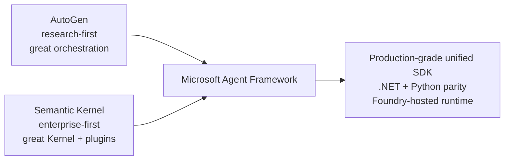

# Why Microsoft Agent Framework

> The case for a new framework, told from primary sources, then reframed in
> product-builder language.

## The official one-liner

> "Microsoft Agent Framework unifies the enterprise-ready foundations of
> Semantic Kernel with the innovative orchestration of AutoGen."[^official]

That sentence is doing a lot of work. Decoded:

- *Enterprise-ready foundations of Semantic Kernel* = DI-friendly Kernel,
  filters, plugins, Process Framework heritage.
- *Innovative orchestration of AutoGen* = group chat, swarm, Magentic, the
  conversable-agent abstractions.
- *Unify* = one API, not two; one common base class (`AIAgent` / `BaseAgent`);
  one runtime; one telemetry surface.

## The two convergent pressures

### From the AutoGen side

- Rich orchestration patterns; researcher-loved abstractions.
- Lacked: durability, native middleware, .NET parity, managed runtime,
  workflow engine, declarative manifests, registry-friendly contracts.

### From the Semantic Kernel side

- Strong enterprise integration (.NET DI, plugins, Process Framework).
- Lacked: AutoGen's ergonomic multi-agent patterns; modern provider-agnostic
  abstractions; a unified Python story comparable to .NET.

### Microsoft's choice

Instead of patching both, *converge*. Take the best of each, design the
contract for production from day one, ship parity in Python and .NET.

## Why a *new* framework, not a Semantic Kernel v2 or AutoGen v0.5

**(inference, but consistent with public devblog signals)**

1. **Naming rights matter.** Calling it "Semantic Kernel 2.0" would have
   carried Kernel-shaped expectations; calling it "AutoGen 0.5" would have
   imported research-framework expectations.
2. **Clean slate for the contract.** The new framework picks abstractions
   intentionally — `AIAgent`, `Workflow`, `IChatClient` — without legacy
   v0.2 / SK-1.x baggage.
3. **Stronger signal of intent.** A *new* framework with a *new* GA + LTS
   is a stronger marketing and engineering commitment than a renamed v2.
4. **Convergence narrative.** A unified framework signals to the market
   that Microsoft has chosen a single bet for the production agent SDK.

## What the new framework provides that the old ones didn't

This is the value-prop matrix:

| Capability | AutoGen 0.4 | Semantic Kernel | MAF |
|---|---|---|---|
| `IChatClient`-style provider parity | partial | partial | **yes**[^iChatClient] |
| Multi-agent orchestration | excellent | mid | excellent |
| Typed graph workflows | no | Process Framework (state machine) | **yes**[^workflows] |
| Durable checkpointing | limited | in Process Fwk | **yes** |
| Time-travel / replay | no | limited | **yes** |
| Native HITL primitive | UserProxy | Process Fwk steps | **`RequestInfoExecutor`** |
| Middleware pipeline | no | filters | **yes**[^maf-mw] |
| OpenTelemetry-native | yes (since 0.4) | yes | **yes (with DevUI)** |
| Declarative YAML agents | no | partial | **yes** |
| Foundry-hosted runtime | no | n/a | **yes** |
| .NET + Python parity | partial | yes (3 langs) | **yes** |
| LTS commitment | no | partial | **yes (1.0)**[^ga] |

## Prototype agent system vs enterprise agent platform

| Concern | Prototype agent system (AutoGen-shape) | Enterprise agent platform (MAF-shape) |
|---|---|---|
| Goal | Show that an agent can do X | Run agents reliably for many users / teams |
| Lifecycle | Run-it-yourself | Deploy, version, deprecate |
| Identity | Default key in env var | Per-user / per-tenant Entra/AAD |
| State | In-memory | Durable checkpoints + time-travel |
| Observability | Logs | OTel spans + GenAI semantic conventions + DevUI |
| Governance | Trust the developer | Manifests, registry, ownership, approvals |
| HITL | `input()` or chat reply | Typed durable approvals |
| Tools | Whatever functions you wrote | Policy-fronted tool gateway |
| Eval | "Looks right" | Golden sets + LLM-judge + CI gating |
| Hosting | `python main.py` | Managed runtime (Foundry-hosted), autoscale, identity |

> **The single most useful framing:** *AutoGen helped developers explore what
> agents could do. MAF helps developers build, operate, and govern agents
> systematically.*

## Why this matters in product-builder language

If you're a PM/architect deciding whether to migrate, the *commercial* logic
is:

1. **Reduced operational cost.** Native OTel + DevUI cuts incident MTTR.
2. **Reduced platform sprawl.** One framework for .NET and Python, one
   runtime story for managed and self-hosted, one tooling surface.
3. **Faster cross-team adoption.** Declarative agents + manifests let many
   teams ship without re-deriving conventions.
4. **Lower model-vendor risk.** `IChatClient` parity = swap providers under
   pricing or capability pressure.
5. **Better evaluation discipline.** Golden-set evals + AF Labs +
   Foundry Eval surfaces regressions before users see them.
6. **Better hiring story.** Hiring an agent platform team is easier when
   you can say "we standardise on MAF" than "we have a custom AutoGen
   harness."

## The "fair to AutoGen" caveat

This page argues the case *for* MAF, but it isn't a case *against* AutoGen.
Several legitimate reasons to stay on AutoGen:

- Active research on novel multi-agent patterns where MAF's structure adds
  friction.
- Code-execution-heavy agentic research where Magentic-One in AutoGen is
  the most direct expression of the pattern.
- A small Python-only team prototyping; the migration cost outweighs the
  near-term benefits.

The Microsoft Learn migration guide implicitly acknowledges this: AutoGen
continues to ship, MAF is recommended for production.

## Quote-ready for an architecture review

> "We're moving from AutoGen to MAF for one reason: AutoGen's contract is
> *conversation*, MAF's contract is *typed durable workflow*. Conversation
> is great for prototypes; typed durable workflow is what lets us run
> long-lived flows with HITL, replay, governance, and a single OTel
> surface. We're keeping AutoGen for research / exploration where its
> ergonomics shine."

---

[^official]: Microsoft Azure Blog, "Introducing Microsoft Agent Framework," October 1, 2025.
[^iChatClient]: ".NET Blog: Microsoft Agent Framework — Building Blocks for AI" — MAF builds directly on `IChatClient` and `AsAIAgent()` extension over `IChatClient` is a core ergonomic.
[^workflows]: Microsoft Learn, "Microsoft Agent Framework Workflows."
[^maf-mw]: AutoGen → MAF Migration Guide on Microsoft Learn: "Agent Framework introduces middleware capabilities that AutoGen lacks."
[^ga]: "Microsoft Agent Framework Version 1.0," April 3, 2026; LTS commitment for core building blocks (agents, workflows, memory, middleware, orchestration).
