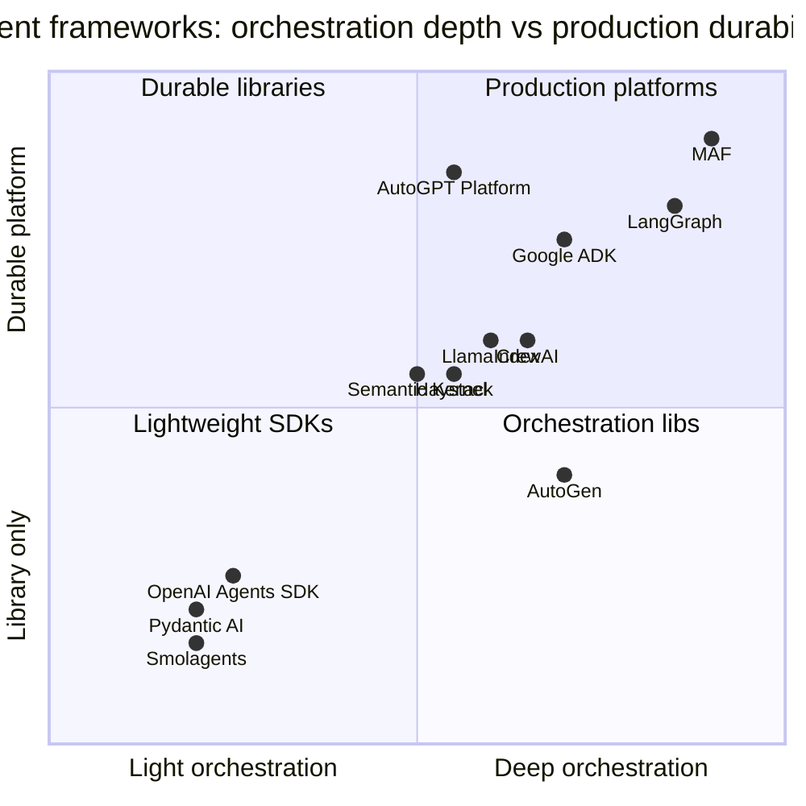
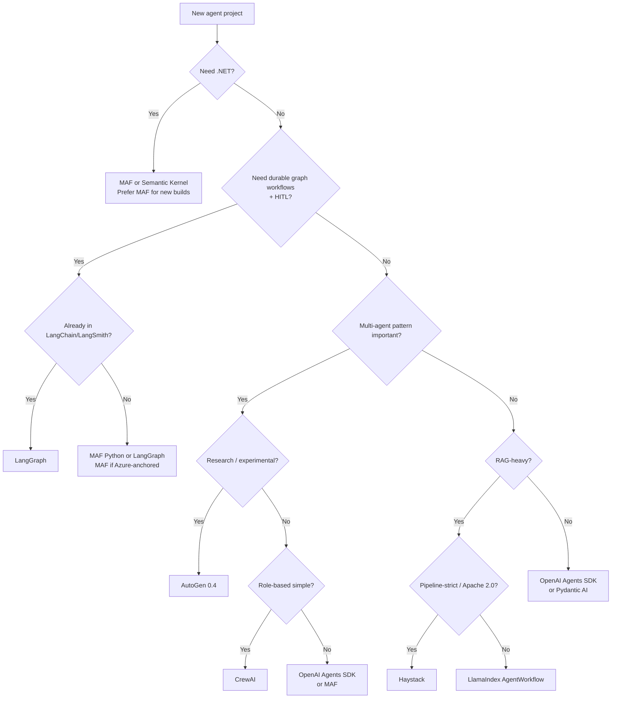

# Open-Source Agent Frameworks — Senior Architect's Research Report

> Author: AI Platform Architecture research note
> Last updated: May 2026
> Scope: Open-source frameworks for building, orchestrating and operating LLM agents and multi-agent systems.

This report is a deep, opinionated study of the major open-source agent frameworks, with extra weight given to the two Microsoft-owned options (**Microsoft AutoGen** and **Microsoft Agent Framework / MAF**), since the host repository is `microsoft/agent-framework`. It is intended to help architects choose, combine and operate these frameworks in production.

---

## Table of contents

1. [Summary table](#1-summary-table)
2. [Detailed framework-by-framework notes](#2-detailed-framework-by-framework-notes)
   1. [Microsoft AutoGen](#21-microsoft-autogen)
   2. [Microsoft Agent Framework (MAF)](#22-microsoft-agent-framework-maf)
   3. [Semantic Kernel](#23-semantic-kernel)
   4. [LangGraph](#24-langgraph)
   5. [CrewAI](#25-crewai)
   6. [OpenAI Agents SDK](#26-openai-agents-sdk)
   7. [LlamaIndex Workflows / AgentWorkflow](#27-llamaindex-workflows--agentworkflow)
   8. [Haystack Agents](#28-haystack-agents)
   9. [AutoGPT / Forge](#29-autogpt--forge)
   10. [Other notable frameworks](#210-other-notable-frameworks)
3. [Comparison matrix](#3-comparison-matrix)
4. [Recommended learning path](#4-recommended-learning-path)
5. [Best framework choices by use case](#5-best-framework-choices-by-use-case)
6. [Curated link index — best docs, guides, repos](#6-curated-link-index--best-docs-guides-repos)
7. [References](#7-references)

---

## 1. Summary table

| # | Framework | Owner | Languages | Primary abstraction | Multi-agent style | Workflow engine | HITL | Observability | Maturity (May 2026) | License |
|---|-----------|-------|-----------|---------------------|-------------------|-----------------|------|---------------|---------------------|---------|
| 1 | **Microsoft AutoGen** | Microsoft Research | Python (.NET-light) | Conversable agents + actor Core | GroupChat, Swarm, Magentic, custom | AgentChat / Core actors | Yes (UserProxyAgent, approvals) | OpenTelemetry, AutoGen Studio | Mature; 0.4.x stable, research-led, succeeded by MAF | MIT |
| 2 | **Microsoft Agent Framework (MAF)** | Microsoft (Foundry/CTO) | Python + .NET | `AIAgent` + graph `Workflow` | Sequential / concurrent / handoff / group / Magentic | First-class graph workflows w/ checkpoint, time-travel | Native `RequestInfo` + approvals | OpenTelemetry, DevUI debugger | **GA 1.0 (Apr 2026)**, LTS, production focus | MIT |
| 3 | **Semantic Kernel** | Microsoft DevDiv | C#, Python, Java | `Kernel` + plugins / planners | Agent Framework + Process Framework | Process Framework (state machine) | Yes (filters, function-call hooks) | OpenTelemetry | Mature; converging into MAF | MIT |
| 4 | **LangGraph** | LangChain Inc. | Python + JS/TS | StateGraph (nodes/edges, reducers) | Supervisor / swarm / hierarchical | Graph + persistence + interrupts | First-class `interrupt()` | LangSmith | Mature; de-facto OSS standard | MIT |
| 5 | **CrewAI** | CrewAI Inc. | Python | Agents, Tasks, Crews + Flows | Role-based crews | Flows (event-driven) | Yes (HumanInput tools) | Built-in + OpenLIT/Langfuse | Mature, enterprise tier (Crew Enterprise) | MIT (core) |
| 6 | **OpenAI Agents SDK** | OpenAI | Python + TS | `Agent` + handoffs + guardrails | Handoff graph (agents-as-tools) | Lightweight runner; sessions | Approvals + interrupts | Built-in tracing (OAI dashboard) | Production-ready, 1.x | MIT |
| 7 | **LlamaIndex AgentWorkflow** | LlamaIndex Inc. | Python + TS | Event-driven `Workflow` + `AgentWorkflow` | Multi-agent over events + Context | Workflows 1.0 (asyncio events) | `wait_for_event`, HITL events | Llama Cloud, OpenInference | Mature for RAG-heavy agents | MIT |
| 8 | **Haystack Agents** | deepset | Python | `Pipeline` + `Agent` component | Agent + sub-pipelines as tools | Pipelines (DAG with branches/loops) | Custom (HumanInput tool) | OpenTelemetry, deepset Studio | Mature 2.x, retrieval-first | Apache 2.0 |
| 9 | **AutoGPT / Forge** | Significant Gravitas | Python + TS (UI) | Block-graph runtime + Forge SDK | Single autonomous agent w/ blocks | AutoGPT Platform graph builder | Manual approval per step | Platform telemetry | Niche; pivoted to platform/marketplace | Polyform Shield (platform) + MIT (Forge/Classic) |
| 10a | **Pydantic AI** | Pydantic Team | Python | Type-safe `Agent` + tools | Agent-as-tool, A2A | Lightweight | Yes (function approvals) | Logfire | Fast-rising, 1.x | MIT |
| 10b | **Smolagents** | Hugging Face | Python | Code-writing agents | Manager + worker code agents | None (loop) | Manual | HF + OpenTelemetry | Lightweight, growing | Apache 2.0 |
| 10c | **Letta** (ex-MemGPT) | Letta Labs | Python + TS | Stateful `Agent` server with memory | Multi-agent shared memory | Letta server | Yes | Built-in | Memory-specialist | Apache 2.0 |
| 10d | **MetaGPT** | DeepWisdom | Python | Role-based "software company" | SOP-driven role hierarchy | StanFord-SOP graph | Limited | Custom | Research-heavy | MIT |
| 10e | **Google ADK** | Google | Python + Java | `LlmAgent` + tools + sessions | Sequential/parallel/loop agents | ADK Runner | Yes | Vertex AI + OTel | New (2025), maturing fast | Apache 2.0 |

---

## 2. Detailed framework-by-framework notes

For each framework I use a consistent template:

> Problem · When to use · Architecture · Lifecycle · Tools · Memory · Multi-agent · Workflow · HITL · Eval · Observability · Deployment · Enterprise · Examples · Docs · Community · Maturity · Pros / Cons · Compared to AutoGen · Compared to MAF.

---

### 2.1 Microsoft AutoGen

**Repo:** [`microsoft/autogen`](https://github.com/microsoft/autogen) · **Docs:** [microsoft.github.io/autogen](https://microsoft.github.io/autogen/stable/) · **License:** MIT.

**Problem it solves.** AutoGen pioneered the *conversable multi-agent* pattern: arbitrary teams of LLM-driven agents (and humans) collaborate by *messaging* each other to solve a task. It originated as a Microsoft Research project to study how LLM agents could plan, code, critique and self-correct in groups.

**When to use.**
- Research on multi-agent collaboration, debate, planner/executor, code-execution-in-the-loop.
- Prototyping novel orchestration patterns (Magentic-One, Swarm, GroupChatManager) before standardising on a production platform.
- Code-heavy agentic tasks where the **CodeExecutor** (Docker / Jupyter) is a first-class citizen.

**Architecture.** Since v0.4 (Jan 2025), AutoGen has a **layered architecture**:

1. **`autogen-core`** — async, event-driven actor runtime. Agents are addressable entities communicating by messages. Single-process or distributed (gRPC) runtimes.
2. **`autogen-agentchat`** — high-level conversational API: `AssistantAgent`, `UserProxyAgent`, `RoundRobinGroupChat`, `SelectorGroupChat`, `Swarm`, `MagenticOneGroupChat`.
3. **`autogen-ext`** — extensions: model clients (OpenAI, Azure, Anthropic, Ollama), code executors (Docker, Jupyter, Azure ACI), tools, web surfers, MCP.
4. **AutoGen Studio** — low-code web UI on top of AgentChat for design/test.
5. **AutoGen Bench** — benchmark harness for agent evaluation.

**Agent lifecycle.** Build → register with runtime → start runtime → publish task message → agents subscribe and respond → termination condition (`MaxMessageTermination`, `TextMentionTermination`, etc.) → runtime stop. Streaming via async iterators of `BaseChatMessage`.

**Tool-calling model.** Functions become tools with type hints; `FunctionTool` wraps Python callables. MCP tools are first-class via `mcp_server_tools()`. Tools are bound to an agent at construction; the LLM emits OpenAI-style tool calls which the framework executes and feeds back as `ToolCallResultMessage`.

**Memory model.** Stateless by default — `AssistantAgent` keeps a model context (sliding window, buffered, head-and-tail, or a `Memory` provider). The `Memory` interface allows pluggable stores (ChromaDB, Mem0, custom). Long-term memory is intentionally an extension point, not built in.

**Multi-agent orchestration.** This is AutoGen's headline feature:
- `RoundRobinGroupChat` — deterministic rotation.
- `SelectorGroupChat` — an LLM picks the next speaker.
- `Swarm` — agents handoff via tool calls (similar to OpenAI Swarm).
- `MagenticOneGroupChat` — Magentic-One orchestrator coordinates web/file/code/coder agents.
- Custom: write your own subclass of `BaseGroupChat` or wire up Core actors directly.

**Workflow support.** AutoGen treats orchestration as *conversation*, not as a DAG. There is no first-class graph workflow type (that is exactly what MAF added). Repeatable structured pipelines must be built atop Core actors.

**Human-in-the-loop.** `UserProxyAgent` participates as a human; `input_func` callbacks let you wire web/CLI/Slack inputs. Magentic / Swarm patterns can pause and ask for input.

**Evaluation.** `autogen-bench` runs scenario suites (HumanEval, GAIA, AssistantBench, etc.) and reports scores. `autogen-agentchat` supports message-level assertions for tests.

**Observability.** OpenTelemetry traces and metrics across runtime + AgentChat (spans for agent runs, model calls, tool calls). AutoGen Studio includes a session viewer.

**Deployment.** Local Python process; distributed `agentic` runtime over gRPC; AutoGen Studio is a FastAPI app. Containerisable but not opinionated about hosting.

**Enterprise readiness.** Mid-tier. OTel + code-execution sandboxing are good, but governance, durable workflow checkpointing and managed hosting are not first-class — that gap is exactly what MAF was created to close. Microsoft's official statement: AutoGen continues as a research playground; production users are guided to MAF.

**Examples.** [`python/samples`](https://github.com/microsoft/autogen/tree/main/python/samples) (agentchat, core, magentic-one, distributed). Notable: `magentic_one`, `gaia_runner`, `swarm`.

**Documentation quality.** Strong: layered tutorials (Core, AgentChat, Extensions), migration guides from 0.2 and to MAF, architecture deep-dives. Some examples lag the latest API changes.

**Community activity.** Very high (40k+ GitHub stars, Discord, weekly office hours). Maintained primarily by MSR + community.

**Maturity level.** Mature research framework; v0.4.x is the stable line; Microsoft has positioned MAF as the production successor.

**Pros.**
- Best-in-class multi-agent conversation primitives.
- Rich research patterns (Magentic-One, Swarm).
- Strong code-execution story.
- Healthy community.

**Cons.**
- API churn between 0.2 → 0.4.
- No native durable workflow / time-travel.
- Production deployment patterns are DIY.
- .NET support is limited (community).

**Vs. Microsoft Agent Framework.** AutoGen is the *research lineage* — chat-centric, flexible, exploratory. MAF is the *production lineage* — same agent ergonomics plus typed graph workflows, checkpointing, hosting and .NET parity. If you're doing novel multi-agent research, stay on AutoGen; if you're shipping, port to MAF (Microsoft publishes a [migration guide](https://learn.microsoft.com/en-us/agent-framework/migration-guide/from-autogen/)).

---

### 2.2 Microsoft Agent Framework (MAF)

**Repo:** [`microsoft/agent-framework`](https://github.com/microsoft/agent-framework) · **Docs:** [learn.microsoft.com/agent-framework](https://learn.microsoft.com/en-us/agent-framework/) · **License:** MIT.

**Problem it solves.** MAF unifies and *productionises* the best ideas from AutoGen and Semantic Kernel into a single, multi-language, opinionated framework: ergonomic agent abstractions, graph-based workflows, durable state, observability, governance, and turnkey hosting on Microsoft Foundry — while staying provider-agnostic.

**When to use.** This is Microsoft's recommended default for any new agent system, especially:
- You need *both* .NET and Python.
- You want graph-based workflows with checkpointing, restart, and time-travel.
- You care about OTel observability, governance, and Foundry / Azure hosting.
- You're migrating off Semantic Kernel or AutoGen and need an LTS API.

**Architecture (high level).**
- **`AIAgent`** — the agent abstraction. Concrete implementations: `ChatAgent` (provider-agnostic), `OpenAIChatClient`, `AzureOpenAIChatClient`, `AnthropicChatClient`, `FoundryChatClient`, `OllamaChatClient`, `BedrockChatClient`, etc. Backed by Microsoft.Extensions.AI (`IChatClient`).
- **Tools** — function tools, MCP tools, OpenAPI tools, Foundry-hosted tools (Bing, file search, code interpreter), plus first-class `AIFunction`/Python `@ai_function`.
- **Middleware** — request/response/exception pipelines (telemetry, retries, redaction, security filters).
- **Workflows** — typed graph engine (`Workflow`, `Executor`, `Edge`, `WorkflowBuilder`). Supports sequential, concurrent (fan-out/fan-in), handoff, group chat, Magentic and custom topologies. Streaming events, **checkpointing**, **resume**, **time-travel**, **sub-workflows**.
- **Memory** — `IMemory` providers (Foundry memory, Redis, custom), thread-scoped state (`AgentThread`).
- **Skills** — domain knowledge bundles (files, snippets, libraries) discoverable by agents.
- **Hosting / runtime** — local dev, ASP.NET Core, FastAPI, Foundry-hosted agents (deploy with two extra lines of code), Agent Harness for shell/file/messaging loops.
- **DevUI** — browser debugger that visualises message flow, tool calls, state, and workflow graphs in real time.
- **Front-end adapters** — AG-UI, CopilotKit, ChatKit.

**Agent lifecycle.** `Create chat client → build AIAgent (instructions, tools, memory) → optional middleware → invoke (streaming or not) → AgentThread carries state across turns → optional checkpoint to durable store → optional rehydration / handoff to workflow`.

**Tool-calling model.** Annotated functions (`[Description]` in .NET, type hints + docstring in Python) are turned into tool schemas via Microsoft.Extensions.AI. Tool execution is middleware-routed; supports parallel tool calls, approvals, and Foundry hosted tools (no local execution).

**Memory model.** Per-thread message store + pluggable long-term `IMemory`. Foundry-hosted memory (preview), Redis, custom providers. Memory is queried as part of the agent's prompt assembly; explicit recall semantics rather than LangChain's chain-of-runnables.

**Multi-agent orchestration.** Workflow patterns shipped out of the box:
- **Sequential** — chain agents.
- **Concurrent** — fan-out + fan-in / map-reduce.
- **Handoff** — agents transfer control via typed handoff edges.
- **Group chat** — moderated conversation among agents.
- **Magentic** — orchestrator + worker pattern from MSR.

**Workflow support.** Best in class among generalist frameworks: typed messages between executors, durable checkpoints, resumable runs, sub-workflows, conditional/dynamic edges, streaming events, graph visualisation in DevUI.

**Human-in-the-loop.** First-class. `RequestInfoExecutor` pauses a workflow and emits a `RequestInfo` event; the host application returns a `RespondInfo` to resume. Supports tool-call approval flows and front-end adapters (CopilotKit / AG-UI / ChatKit).

**Evaluation.** Preview: workflow-level evaluators (regression, golden-set, LLM-as-judge), `agent-framework-lab` packages, integration with Foundry evaluations.

**Observability.** Native OpenTelemetry (spans for agent run, model call, tool call, executor, workflow event). Drop-in for App Insights, Jaeger, Honeycomb, Langfuse, Phoenix. DevUI uses the same OTel feed locally.

**Deployment.** Local; ASP.NET Core or FastAPI service; **Foundry-hosted agents** (managed, autoscaled); Azure Container Apps / AKS; Agent Harness for shell-and-file loops; works with any compute that runs Python or .NET.

**Enterprise readiness.** Highest of any open-source agent framework today: stable APIs (1.0 LTS, April 2026), governance, OTel, durable workflows, signed builds, AAD/Entra integration, Foundry policy controls, Microsoft commercial support paths.

**Examples.**
- [`python/samples`](../../python/samples/) — getting-started, agents (providers, middleware, observability), workflows (sequential, concurrent, handoff, magentic, checkpointing, HITL), hosting (Foundry, ASP.NET parity).
- [`dotnet/samples`](../../dotnet/samples/) — same hierarchy in .NET.
- [`declarative-agents/`](../../declarative-agents/) — YAML-defined agents.

**Documentation quality.** Excellent: MS Learn site, devblogs.microsoft.com/agent-framework, design decision records (ADRs) in [`docs/decisions`](../decisions/), feature specs in [`docs/features`](../features/), migration guides from AutoGen and SK.

**Community activity.** Rapidly growing; Microsoft Foundry Discord, weekly Foundry community calls, increasing third-party samples.

**Maturity level.** GA 1.0 since April 2026 with LTS commitment for core building blocks (agents, workflows, memory, middleware, orchestration). DevUI, evaluations, Foundry-hosted agents, and front-end adapters remain in preview.

**Pros.**
- True .NET + Python parity.
- Graph workflows with durability, checkpointing, time-travel, HITL.
- Provider-agnostic (Foundry, Azure OpenAI, OpenAI, Anthropic, Bedrock, GitHub Copilot SDK, Claude Code SDK, Ollama).
- DevUI is best-in-class for local debugging.
- Clean OTel.

**Cons.**
- Younger community than AutoGen / LangGraph.
- Some preview features (DevUI, evaluations) still moving.
- Steeper learning curve than CrewAI for newcomers.

**Vs. AutoGen.** Same agent feel; adds graph workflows, durability, HITL primitives, .NET parity, hosting and DevUI. AutoGen is research; MAF is production.

---

### 2.3 Semantic Kernel

**Repo:** [`microsoft/semantic-kernel`](https://github.com/microsoft/semantic-kernel) · **Docs:** [learn.microsoft.com/semantic-kernel](https://learn.microsoft.com/en-us/semantic-kernel/) · **License:** MIT.

**Problem it solves.** SK was Microsoft's first-generation "AI orchestration SDK": treat LLM functions as plugins inside a `Kernel`, build planners and chat completion agents, and integrate cleanly into existing C# / Python / Java apps.

**When to use.**
- You're already on SK and on a stable workload — no need to rewrite.
- You want a lightweight C#/Java-first SDK to call LLMs and tools without going full agent-platform.
- You need the **Process Framework** (state-machine business processes with LLM steps).

**Architecture.**
- `Kernel` — DI container holding plugins, AI services, filters, prompts.
- **Plugins** — collections of `KernelFunction`s (native or prompt-template).
- **Connectors** — chat completion / embedding / vector store providers.
- **Filters / hooks** — pre/post invocation interception.
- **Agent Framework** (in SK) — `ChatCompletionAgent`, `OpenAIAssistantAgent`, group chats. *This is the lineage that became MAF.*
- **Process Framework** — long-running state-machine workflows with steps that can be agents, functions or human steps.

**Lifecycle, tools, memory.** Function-calling with auto invoke; memory via `ITextMemory` / vector connectors; prompt templating with Handlebars/Liquid.

**Multi-agent.** Through SK Agent Framework: `AgentGroupChat` with a `SelectionStrategy` and `TerminationStrategy`. Process Framework can host agents as steps.

**Workflow.** Process Framework — explicit state machine with events, parallel steps, retries.

**HITL.** Human steps in Process Framework; filters for tool-call approval.

**Evaluation / observability.** OTel, integrates with App Insights and Foundry Evaluations.

**Deployment.** Library — bring your own host (ASP.NET, FastAPI, Spring).

**Enterprise readiness.** High — used widely inside Microsoft and Fortune 500 .NET shops.

**Examples / docs.** Hundreds of [samples](https://github.com/microsoft/semantic-kernel/tree/main/python/samples) per language. Excellent documentation but increasingly redirects to MAF.

**Community.** Large and very active; SK Champions program; Microsoft devblog.

**Maturity.** Mature; in **convergence mode** — Microsoft positions MAF as the successor to SK Agent Framework. SK as a Kernel/plugin SDK remains supported; agent-specific APIs are guided to MAF.

**Pros / Cons.** Pros: stable, multi-language, big ecosystem, strong .NET integration, Process Framework. Cons: agent abstractions are now duplicated in MAF; future investment focuses on MAF.

**Vs. AutoGen.** SK is enterprise-app-friendly with DI/plugins/Process Framework; AutoGen is researchy. SK's agent layer is less powerful than AutoGen's group chats but more enterprise-shaped.

**Vs. MAF.** MAF is the successor — same .NET feel + multi-language parity + workflows + hosting. New projects should start on MAF unless you're tied to SK Process Framework today.

---

### 2.4 LangGraph

**Repo:** [`langchain-ai/langgraph`](https://github.com/langchain-ai/langgraph) · **Docs:** [docs.langchain.com/oss/python/langgraph](https://docs.langchain.com/oss/python/langgraph) · **License:** MIT.

**Problem it solves.** Bring *graph + state-machine* discipline to LLM agent control flow: explicit nodes, edges, reducers, persistence and interrupts — instead of opaque chains.

**When to use.**
- You want a programmable, durable, debuggable agent graph.
- You need first-class HITL with `interrupt()` and time-travel.
- You're already in the LangChain / LangSmith ecosystem.

**Architecture.**
- `StateGraph` — typed state (TypedDict) with **reducers** controlling how each field merges across steps.
- **Nodes** — Python functions (sync/async) that receive state and return updates.
- **Edges** — static or conditional routing functions.
- **Checkpointer** — pluggable persistence (`MemorySaver`, `SqliteSaver`, `PostgresSaver`, Redis, AWS Bedrock Sessions, etc.). Each step is a checkpoint inside a *thread*.
- **Interrupts** — `interrupt()` halts a thread and surfaces a value to the host; `Command(resume=…)` resumes.
- **LangGraph Studio / Platform** — visualiser, deploy runtime, scheduling, REST/SSE/Streaming, plus LangSmith for tracing/eval.

**Agent lifecycle.** Build graph → compile with checkpointer → invoke with `thread_id` → state reduces step by step → optional interrupt → resume → terminal.

**Tool-calling.** Through LangChain `Tool` / `@tool` decorator; `ToolNode` handles execution. Prebuilt `create_react_agent` returns a ready-made ReAct StateGraph.

**Memory.** Short-term: graph state + checkpointer. Long-term: `BaseStore` (`InMemoryStore`, Postgres) for cross-thread memories; LangMem for vector-backed long-term memory.

**Multi-agent orchestration.** Patterns: **supervisor**, **swarm**, **hierarchical**, **network**. `langgraph-supervisor` and `langgraph-swarm` are dedicated packages. Each agent is a sub-graph.

**Workflow.** This *is* the workflow engine — LangGraph is in many ways closer to Temporal-lite than to a chat framework. Good for long-running, branching processes; integrates with Temporal for very-long-running workloads.

**HITL.** Native: `interrupt()` + Studio approval UI; can fork or rewind threads.

**Evaluation.** LangSmith evaluations, `langgraph-evals` patterns, dataset replay against checkpoints.

**Observability.** LangSmith out of the box; OTel exporters available; Studio visualises live graph state.

**Deployment.** Self-host with Postgres; **LangGraph Platform** (managed runtime with scheduling, queues, cron); JS/TS port for Node deployments.

**Enterprise readiness.** High — used at Klarna, Replit, Elastic, etc.; SOC2 LangSmith.

**Examples.** [`langgraph/examples`](https://github.com/langchain-ai/langgraph/tree/main/examples), templates for ReAct, RAG, multi-agent supervisor/swarm, deep research; canonical book is the LangChain Academy "Introduction to LangGraph" course.

**Documentation quality.** Excellent and improving (rewritten in 2025–26). Concept docs and how-tos are unusually good.

**Community.** Very large — LangChain ecosystem. Discord, weekly office hours.

**Maturity.** Mature; arguably the de-facto OSS agent workflow engine.

**Pros.**
- Graph + persistence is the right abstraction for agentic workflows.
- HITL and time-travel are native.
- LangSmith is a strong eval/observability story.

**Cons.**
- Best inside LangChain ecosystem; some impedance otherwise.
- State schema + reducers feels heavy at first.
- Latency of LangSmith hosted features is opinionated.

**Vs. AutoGen.** LangGraph is a workflow engine first, conversation second; AutoGen is the inverse. LangGraph has stronger durability and HITL; AutoGen has richer pre-built multi-agent chat patterns.

**Vs. MAF.** Closest peer — both are graph-workflow-first agent frameworks. MAF has .NET parity, Foundry hosting, declarative agents, and a tighter Microsoft ecosystem; LangGraph has a more mature OSS ecosystem, LangSmith and a larger community. Many teams use both: LangGraph + LangSmith for OSS-only stacks, MAF for Azure-anchored .NET/Python stacks.

---

### 2.5 CrewAI

**Repo:** [`crewAIInc/crewAI`](https://github.com/crewAIInc/crewAI) · **Docs:** [docs.crewai.com](https://docs.crewai.com/) · **License:** MIT (core).

**Problem it solves.** Make multi-agent collaboration feel like staffing a team: you describe **roles**, **goals**, **tasks** and **a crew**, and CrewAI orchestrates the rest. Add **Flows** for event-driven production pipelines.

**When to use.**
- Business automation where natural-language role definitions map cleanly to org structure ("Researcher", "Editor", "Strategist").
- Quick wins for non-engineers and PMs.
- Production pipelines stitching multiple crews via Flows.

**Architecture.**
- **Agent** — role + goal + backstory + tools + LLM.
- **Task** — description + expected output + assigned agent.
- **Crew** — list of agents + tasks + process (`sequential` or `hierarchical` with manager LLM) + memory + cache.
- **Flow** — event-driven graph layer (`@start`, `@listen`, `@router`) with state; can call crews or arbitrary code as steps.
- **Tools** — `BaseTool` subclasses or LangChain tools; rich built-in catalogue (web search, file IO, RAG, code interpreters).

**Lifecycle.** Define roles → instantiate crew → `crew.kickoff(inputs={...})` → tasks run sequentially or via manager → outputs flow → optional Flow handles broader pipeline.

**Tool-calling.** Native function-calling for OpenAI/Anthropic/Bedrock/Ollama. Tools support caching and result schemas.

**Memory.** Short-term, long-term, and entity memory backed by `mem0` or local vector stores; per-crew + per-agent.

**Multi-agent orchestration.** Hierarchical (manager + workers) or peer (sequential). Flows compose multiple crews.

**Workflow.** Flows ≈ event-driven micro-workflows; not as expressive as LangGraph or MAF but covers most business cases.

**HITL.** `human_input=True` on a task; approval/feedback in CLI; tools wrapping web/email forms.

**Evaluation.** Official `crewai-eval` suite; integration with OpenLIT, Langfuse, Arize, AgentOps.

**Observability.** OpenLIT/Langfuse/AgentOps/PromptLayer integrations; Crew Enterprise has built-in dashboards.

**Deployment.** Python module; Crew Studio (drag-and-drop); **Crew Enterprise** (managed runtime, deployments, dashboards, RBAC).

**Enterprise readiness.** Mid-to-high (with Crew Enterprise commercial tier).

**Examples.** [`crewAI-examples`](https://github.com/crewAIInc/crewAI-examples) — research crews, code review, marketing, finance, content generation. Lots of YouTube tutorials.

**Documentation quality.** Friendly and tutorial-heavy; less rigorous than LangGraph/MAF.

**Community.** Large and very active in the "vibe coder" / business-automation segment.

**Maturity.** Mature for its niche; rapid releases.

**Pros.**
- Lowest friction for role-based multi-agent.
- Excellent for business teams.
- Flows give a production-ish layer.

**Cons.**
- Less control over LLM cost/latency than graph frameworks.
- Reasoning traces can be loose.
- Heavily LLM-dependent (failure modes are emergent).

**Vs. AutoGen.** CrewAI is more opinionated and friendlier; AutoGen exposes more knobs and patterns. AutoGen better for research; CrewAI better for "ship a multi-agent pipeline this week".

**Vs. MAF.** MAF is more rigorous and durable; CrewAI is faster to start. Pair them: prototype in CrewAI, harden in MAF if you need workflows + governance.

---

### 2.6 OpenAI Agents SDK

**Repo:** [`openai/openai-agents-python`](https://github.com/openai/openai-agents-python) (+ [`openai/openai-agents-js`](https://github.com/openai/openai-agents-js)) · **Docs:** [openai.github.io/openai-agents-python](https://openai.github.io/openai-agents-python/) · **License:** MIT.

**Problem it solves.** A small, opinionated agent SDK that grew out of OpenAI's Swarm experiment. Provides clean primitives: **Agents**, **Tools**, **Handoffs**, **Guardrails**, **Sessions**, **Tracing** — minimal magic, production-friendly.

**When to use.**
- You're targeting OpenAI Responses API but want provider-agnostic structure.
- You like minimal frameworks (Pydantic-AI feel) and want first-class handoffs.
- You want OpenAI's hosted tracing dashboard "for free".

**Architecture.** Pure Python (and TS):
- `Agent(name, instructions, tools, handoffs, guardrails)`.
- **Runner** loop drives turns until terminal.
- **Sessions** hold thread state.
- **Handoffs** are *tools* the LLM emits to delegate.
- **Guardrails** are async checks running in parallel with execution; tripwire raises and halts.
- **Tracing** is automatic and exports to OpenAI's dashboard or any OTel/Logfire/Langfuse exporter.

**Lifecycle.** `Runner.run(agent, input, session)` → loop: model call → tool calls / handoffs / guardrails → terminal output.

**Tools.** `@function_tool` decorator on Python functions; hosted tools (web search, file search, computer use, code interpreter) via OpenAI; agents-as-tools (`agent.as_tool()`); MCP support.

**Memory.** Sessions provide per-thread memory; long-term memory is BYO (vector store, etc.).

**Multi-agent.** Handoffs build a directed graph of specialists. Agents-as-tools is the "manager" alternative.

**Workflow.** Deliberately minimal — no graph engine. For complex flows, embed Agents SDK calls inside Temporal/LangGraph/MAF.

**HITL.** `RunHooks` and approvals on tool calls; interrupts and human-loop patterns documented.

**Eval / observability.** Built-in tracing with spans (model, tool, handoff, guardrail); pluggable processors (Logfire, Langfuse, Phoenix, Datadog, AgentOps).

**Deployment.** Library; pair with FastAPI/Express. No managed runtime.

**Enterprise readiness.** Solid for OpenAI-centric stacks; less opinionated for multi-cloud and durability.

**Examples.** [`examples/`](https://github.com/openai/openai-agents-python/tree/main/examples) — research bot, customer service, voice, MCP, financial research.

**Documentation quality.** Crisp and well-structured.

**Community.** Growing fast; backed by OpenAI; TS port has parity with Python.

**Maturity.** Production-ready 1.x.

**Pros.** Minimal, ergonomic, great handoffs/guardrails/tracing; provider-agnostic *in practice*; TS parity.

**Cons.** No graph workflow; no durable runtime; hosted tracing is OpenAI by default.

**Vs. AutoGen.** Smaller surface; lacks AutoGen's group-chat patterns; gains tracing & guardrails.

**Vs. MAF.** Comparable for single-agent and handoff scenarios; MAF wins on workflows, durability, .NET, hosting; OpenAI Agents SDK wins on minimalism and Responses-API-native ergonomics.

---

### 2.7 LlamaIndex Workflows / AgentWorkflow

**Repo:** [`run-llama/llama_index`](https://github.com/run-llama/llama_index) · **Docs:** [developers.llamaindex.ai](https://developers.llamaindex.ai/) · **License:** MIT.

**Problem it solves.** Treat agent and RAG pipelines as **event-driven workflows** of Python coroutines reacting to events on a shared `Context`. AgentWorkflow layers a multi-agent orchestrator on top of Workflows 1.0 (June 2025 GA).

**When to use.**
- RAG-heavy applications where retrieval, reranking, citation and tool-use must compose with agent reasoning.
- You like Python `asyncio` event-driven semantics.
- You want a single framework that spans RAG and agents.

**Architecture.**
- `Workflow` — class with `@step` methods that consume and emit `Event`s; runs to completion.
- `Context` — shared state across steps (kv, streaming).
- `AgentWorkflow` — pre-built workflow orchestrating a list of `FunctionAgent` / `ReActAgent` instances with handoffs.
- Tools are `FunctionTool`/`QueryEngineTool`.

**Lifecycle.** `workflow.run(input)` → step graph driven by events → context updates → final event.

**Tools / memory.** Functions, query engines, retrievers, MCP. Memory via `ChatMemoryBuffer`, vector stores, llama-cloud.

**Multi-agent.** AgentWorkflow handles routing/handoffs and a global Context.

**Workflow.** Native event-driven `Workflow` engine — closest to LangGraph's StateGraph but expressed as event handlers; supports streaming, branching, loops, sub-workflows, retries.

**HITL.** `wait_for_event` pattern (e.g., `HumanResponseEvent`); UI integrations.

**Eval / observability.** LlamaIndex Evaluations, OpenInference, Llama Cloud traces.

**Deployment.** Library; **Llama Cloud** managed runtime for production deployments.

**Enterprise readiness.** Mid-to-high, especially when paired with Llama Cloud.

**Examples.** Many under [`docs/examples/agent`](https://docs.llamaindex.ai/en/stable/examples/agent/), notably `agent_workflow_multi`, `agent_workflow_basic`.

**Docs.** Excellent for RAG; AgentWorkflow docs improving steadily.

**Community.** Very large in the RAG community.

**Maturity.** Workflows 1.0 GA; AgentWorkflow stable.

**Pros.** Best RAG integration of any agent framework; clean event semantics; multi-agent + Context.

**Cons.** Smaller multi-agent pattern catalogue; less .NET; primarily Python.

**Vs. AutoGen.** AutoGen has richer multi-agent chat; LlamaIndex has stronger RAG and event-driven workflows.

**Vs. MAF.** MAF has stronger durability/checkpointing and .NET; LlamaIndex has stronger RAG and Llama Cloud. Pair them: MAF for orchestration, LlamaIndex query engines as tools.

---

### 2.8 Haystack Agents

**Repo:** [`deepset-ai/haystack`](https://github.com/deepset-ai/haystack) · **Docs:** [docs.haystack.deepset.ai](https://docs.haystack.deepset.ai/docs/intro) · **License:** Apache 2.0.

**Problem it solves.** Bring rigorous, typed, production-grade pipeline composition to LLM apps and agents — with a strong retrieval / search heritage from deepset.

**When to use.**
- Search-heavy production systems (enterprise RAG, semantic search, doc QA).
- Teams wanting Apache 2.0 licensing and explicit pipelines.
- Hybrid agentic + classical NLP pipelines.

**Architecture.**
- **Components** — typed inputs/outputs.
- **Pipelines** — DAG with branches and loops.
- **Agent** — pipeline component that loops a `ChatGenerator` with a `ToolInvoker` until termination.
- **Tools** — `Tool` class, `ComponentTool` (any component as tool), `@tool` decorator. State injection via `State` parameter.

**Lifecycle.** Build pipeline → `pipeline.run({...})` → component graph executes → Agent component loops until done.

**Tools.** Function tools, component tools, MCP, OpenAPI; multiple chat generator integrations (OpenAI, Anthropic, Ollama, Bedrock, Cohere, vLLM).

**Memory.** Conversation memory components, document stores (Elastic, Opensearch, Qdrant, Weaviate, pgvector, MongoDB Atlas).

**Multi-agent.** Sub-pipelines and component tools; less canonical "team of agents" abstraction than CrewAI/AutoGen.

**Workflow.** Pipelines with branches and loops; explicit and typed.

**HITL.** Custom tools (HumanInput); pipelines with confirmation steps.

**Eval / observability.** `haystack-eval`, deepset Studio dashboards, OTel.

**Deployment.** Library + Docker; **deepset Cloud** managed.

**Enterprise readiness.** High in retrieval-heavy enterprise.

**Examples.** [`tutorials`](https://haystack.deepset.ai/tutorials) — tool-calling agent, function calling chat, multi-modal pipelines.

**Docs.** Strong, rigorous; pipeline diagrams; cookbook of recipes.

**Community.** Mature European community; deepset is the commercial backer.

**Maturity.** Haystack 2.x is mature.

**Pros.** Type-safe pipelines; great retrieval; Apache 2.0; deepset Studio.

**Cons.** Multi-agent abstractions are thinner; less "agentic" mindshare than LangGraph/CrewAI.

**Vs. AutoGen / MAF.** Haystack's center of gravity is retrieval pipelines; AutoGen and MAF are agent-first. Use Haystack for sophisticated retrieval and embed it inside MAF/AutoGen as a tool.

---

### 2.9 AutoGPT / Forge

**Repo:** [`Significant-Gravitas/AutoGPT`](https://github.com/Significant-Gravitas/AutoGPT) (and historical [`Auto-GPT-Forge`](https://github.com/Significant-Gravitas/Auto-GPT-Forge)) · **License:** Polyform Shield (platform) + MIT (Forge / Classic).

**Problem it solves.** AutoGPT was the original "give a goal, get an autonomous agent" project. It has since pivoted into:
- **AutoGPT Platform** — a low-code visual block-graph builder with marketplace, credits, model routing.
- **AutoGPT Classic + Forge** — the original autonomous agent + an SDK template.

**When to use.**
- You want a low-code visual platform with a marketplace of "blocks".
- You're studying autonomous agent design and the original Forge SDK pattern.

**Architecture.** Block graphs of typed inputs/outputs; backend in Python; UI in Next.js; marketplace + credits + multi-tenant infra. Forge SDK provides ability registration, memory, LLM abstraction.

**Lifecycle / tools / memory / workflow / HITL / eval / observability.** Platform-level: built-in. Library-level (Forge): basic ability registration, vector memory, OpenAI-style tool calls.

**Deployment.** Self-host or managed AutoGPT Platform; Polyform Shield restricts commercial redistribution.

**Enterprise readiness.** Lower than the others above; more of a *product* than a *framework*.

**Examples / docs / community.** Big nostalgic community; smaller technical mindshare today than in 2023.

**Maturity.** The platform is maintained; Forge is stable but no longer the centre of gravity.

**Pros.** Visual builder; marketplace; battle-tested autonomous loop ideas.

**Cons.** Polyform license restricts commercial use of platform; less suited for embedded library use.

**Vs. AutoGen / MAF.** Different category — AutoGPT Platform is closer to a *product* (think n8n for agents) than a developer SDK. MAF/AutoGen are SDKs you embed.

---

### 2.10 Other notable frameworks

These deserve mention because they show up frequently in 2026 architecture decisions.

#### Pydantic AI
[`pydantic/pydantic-ai`](https://github.com/pydantic/pydantic-ai) · MIT.
"FastAPI-feel" for agents — type-safe `Agent[deps, output]`, structured outputs via Pydantic models, function tools, A2A and MCP, dependency injection, Logfire observability. Excellent for teams that already love Pydantic / FastAPI.

**Compared to MAF/AutoGen.** Smaller surface; closest peer is OpenAI Agents SDK + Pydantic typing. Less multi-agent / workflow ambition. Often used inside MAF/LangGraph nodes for type-safe sub-agents.

#### Smolagents
[`huggingface/smolagents`](https://github.com/huggingface/smolagents) · Apache 2.0.
HuggingFace's minimalist code-writing agent: instead of JSON tool calls, the LLM writes Python that the framework executes in a sandbox. Two flavors: `CodeAgent` and `ToolCallingAgent`. Multi-agent via `ManagedAgent`.

**Compared to MAF/AutoGen.** Much smaller; great for code-centric tasks where the model is strong; depends heavily on model quality.

#### Letta (formerly MemGPT)
[`letta-ai/letta`](https://github.com/letta-ai/letta) · Apache 2.0.
Stateful agents with hierarchical memory (core, archival, recall) running as a server. Good for assistants that need long-term memory across sessions and devices.

**Compared to MAF.** Memory-specialist; complementary — embed Letta as a memory backend behind a MAF agent.

#### MetaGPT
[`FoundationAgents/MetaGPT`](https://github.com/FoundationAgents/MetaGPT) · MIT.
"Software company" of role-based agents (PM, architect, engineer, QA) producing PRDs, designs and code. Heavy SOP-driven hierarchy.

**Compared to AutoGen.** Less general; more opinionated about software-development outputs. AutoGen's Magentic-One is the closest counterpart.

#### Google Agent Development Kit (ADK)
[`google/adk-python`](https://github.com/google/adk-python) · Apache 2.0.
Google's official agent SDK (Python + Java). `LlmAgent`, `SequentialAgent`, `ParallelAgent`, `LoopAgent`, sessions, callbacks, A2A protocol, Vertex AI integration.

**Compared to MAF.** Strong on Google Cloud / Gemini side; MAF parity-with-.NET wins on Microsoft side; both speak A2A / MCP for cross-vendor interop.

#### Mastra (TS) and AG2 (community AutoGen fork)
- **Mastra** — TypeScript-first agent framework; nice for Node-only shops.
- **AG2** — community fork of AutoGen 0.2 that kept the original API style; smaller momentum than v0.4 / MAF.

#### LangChain Agents (legacy)
The classic `AgentExecutor`/`initialize_agent` API is now deprecated in favor of LangGraph. New projects should use LangGraph.

---

## 3. Comparison matrix

### 3.1 Feature matrix

| Capability | AutoGen | MAF | SK | LangGraph | CrewAI | OpenAI SDK | LlamaIndex | Haystack | AutoGPT | Pydantic AI | Smolagents | Letta | MetaGPT | Google ADK |
|---|---|---|---|---|---|---|---|---|---|---|---|---|---|---|
| Languages | Py | Py + .NET | C#/Py/Java | Py + TS | Py | Py + TS | Py + TS | Py | Py + TS UI | Py | Py | Py + TS | Py | Py + Java |
| Single-agent ergonomics | Good | Excellent | Excellent | Good | Excellent | Excellent | Good | Good | n/a | Excellent | Good | Good | Mid | Excellent |
| Multi-agent patterns | Best-in-class | Best-in-class | Mid | Excellent | Excellent | Good (handoffs) | Good | Mid | n/a | Mid | Mid | Mid | Strong (SDLC) | Strong |
| Graph workflow engine | No (Core actors) | **Yes** | Process Fwk | **Yes** | Flows | No | Workflows | Pipelines | Block graph | No | No | No | No | Sequential/Parallel/Loop |
| Durable checkpointing | Limited | **Yes** | In Process Fwk | **Yes** | Partial | No | Partial | No | Platform-level | No | No | Server-side | No | Sessions |
| Time-travel / replay | No | **Yes** | Limited | **Yes** | No | No | Limited | No | No | No | No | Limited | No | No |
| HITL primitives | UserProxy | RequestInfo + adapters | Process Fwk steps | `interrupt()` | human_input | Approvals | wait_for_event | DIY tool | Manual approval | Approvals | Manual | Yes | Limited | Callbacks |
| MCP support | Yes | Yes | Yes | Yes | Yes | Yes | Yes | Yes | Limited | Yes | Yes | Yes | Limited | Yes |
| OpenTelemetry | Yes | Yes (native) | Yes | Yes (+LangSmith) | Yes (integrations) | Yes (built-in) | Yes (OpenInference) | Yes | Platform only | Yes (Logfire) | Yes | Yes | Limited | Yes |
| Eval support | autogen-bench | AF Labs + Foundry Eval | Foundry Eval | LangSmith Eval | crewai-eval | Hosted + custom | LI Evals | haystack-eval | Platform | DIY | DIY | DIY | DIY | Vertex Eval |
| Managed runtime | AutoGen Studio | Foundry-hosted agents | n/a | LangGraph Platform | Crew Enterprise | None | Llama Cloud | deepset Cloud | AutoGPT Platform | None | None | Letta Cloud | None | Vertex Agent Engine |
| Front-end adapters | Studio UI | AG-UI / CopilotKit / ChatKit | n/a | Studio | Crew Studio | None | Chat UI | deepset Studio | Built-in | None | None | Built-in | None | Built-in |
| Declarative agents | No | YAML | Prompt configs | Templates | YAML | No | Workflow YAML | YAML | Visual | No | No | JSON | YAML | YAML |
| License | MIT | MIT | MIT | MIT | MIT | MIT | MIT | Apache 2.0 | Polyform/MIT mix | MIT | Apache 2.0 | Apache 2.0 | MIT | Apache 2.0 |

### 3.2 Architecture vs orchestration vs durability tradeoff

> See diagram source in [`diagrams/comparison-quadrant.mmd`](diagrams/comparison-quadrant.mmd).

### 3.3 When-to-pick decision tree

> Source in [`diagrams/decision-tree.mmd`](diagrams/decision-tree.mmd).

---

## 4. Recommended learning path

A 6-week curriculum for a senior engineer who wants production fluency in agent systems.

**Week 1 — Foundations.**
- Read: OpenAI "Building Agents" cookbook + Anthropic "Building effective agents".
- Build a single-agent ReAct loop with **OpenAI Agents SDK** (Python).
- Add a guardrail and tracing.

**Week 2 — Multi-agent + tools.**
- Build a 3-agent research/writer/critic pipeline with **AutoGen 0.4 AgentChat** (`SelectorGroupChat`).
- Wire MCP tools.
- Run AutoGen Bench on a small task suite.

**Week 3 — Graph workflows.**
- Build the same pipeline in **LangGraph** with checkpointer + `interrupt()` + LangSmith.
- Compare developer experience and observability.

**Week 4 — Microsoft Agent Framework deep dive.**
- Walk the [getting-started Python samples](../../python/samples/01-getting-started/).
- Read [user guide](https://learn.microsoft.com/en-us/agent-framework/user-guide/overview).
- Implement Magentic + handoff workflows; turn on **DevUI**; wire OpenTelemetry to Aspire / Phoenix.
- Repeat one sample in **.NET** to feel the parity.

**Week 5 — Production concerns.**
- Add **HITL** with `RequestInfoExecutor` (MAF) and `interrupt()` (LangGraph).
- Add **memory**: short-term (`AgentThread`), long-term (Foundry memory or Redis).
- Add **evaluations** (Foundry Eval / LangSmith Eval) and a regression test.
- Deploy to Foundry-hosted agents + CopilotKit / AG-UI front-end.

**Week 6 — RAG + business automation.**
- Build a RAG agent with **LlamaIndex AgentWorkflow** or **Haystack Agent**.
- Build a role-based research crew with **CrewAI**.
- Compare against the equivalent in MAF.

**Capstone.** A multi-agent ticketing assistant (intake → triage → research → draft → human approval → resolve) implemented twice — once in LangGraph, once in MAF — instrumented with OTel and evaluated on a 50-task golden set.

---

## 5. Best framework choices by use case

| Use case | Top pick (May 2026) | Strong alternative | Why |
|---|---|---|---|
| **Enterprise agent platform** (governance, multi-language, durability, hosted) | **Microsoft Agent Framework (MAF)** | LangGraph + LangGraph Platform | Only OSS framework with .NET + Python parity, durable graph workflows, HITL primitives, OTel-native, declarative YAML, Foundry-hosted runtime, 1.0 LTS. |
| **Multi-agent research** | **AutoGen 0.4** | LangGraph (supervisor/swarm), MetaGPT | Richest pre-built multi-agent patterns (Magentic-One, Swarm); best community for novel collaboration research; AutoGen Bench. |
| **Production workflow automation** | **LangGraph** | MAF | Mature graph + persistence, time-travel, LangSmith evaluations; very large community. MAF chosen if Microsoft stack. |
| **LLM application backend** (single-agent or light multi-agent inside an existing app) | **OpenAI Agents SDK** | Pydantic AI, MAF (single-agent mode) | Minimal API, handoffs, guardrails, native tracing; Python + TS parity. |
| **Agent observability / evaluation** | **LangSmith** (with LangGraph) | Langfuse (with any), Foundry Eval (with MAF), Arize Phoenix | Best end-to-end traces + evaluations; deeply integrated with LangGraph. |
| **Low-code / no-code agent builder** | **AutoGPT Platform** | n8n + AI nodes, CrewAI Studio, Foundry Agent Studio | Visual block graph + marketplace; non-coder accessible. CrewAI Studio for role-based teams. |
| **RAG-heavy agent system** | **LlamaIndex AgentWorkflow** | Haystack Agent | Best RAG integration; AgentWorkflow + Workflows 1.0 unify retrieval and reasoning. |
| **TypeScript-first** | **OpenAI Agents JS** | LangGraph JS, Mastra | Best TS ergonomics today; LangGraph JS for graph workflows. |
| **Azure / Microsoft 365 / Copilot embeds** | **MAF** (with declarative agents + Copilot adapters) | Semantic Kernel | Designed for it; declarative agents + Copilot SDK + AG-UI / ChatKit. |
| **Long-term memory assistants** | **Letta** behind MAF/LangGraph | LangMem, mem0 | Specialised hierarchical memory engine. |
| **Code-writing agents** | **Smolagents** or **MAF Agent Harness** | OpenAI Agents SDK + computer use | Code-as-action models work best when sandboxed. |

---

## 6. Curated link index — best docs, guides, repos

### Microsoft AutoGen
- Docs: <https://microsoft.github.io/autogen/stable/>
- Repo: <https://github.com/microsoft/autogen>
- Migration to MAF: <https://learn.microsoft.com/en-us/agent-framework/migration-guide/from-autogen/>
- v0.4 launch blog: <https://devblogs.microsoft.com/autogen/autogen-reimagined-launching-autogen-0-4/>
- Magentic-One paper + repo path: `python/packages/autogen-ext/.../magentic_one`

### Microsoft Agent Framework (MAF)
- Docs: <https://learn.microsoft.com/en-us/agent-framework/>
- Workflows: <https://learn.microsoft.com/en-us/agent-framework/workflows/>
- Repo: <https://github.com/microsoft/agent-framework>
- Devblog: <https://devblogs.microsoft.com/agent-framework/>
- Python samples: [`python/samples`](../../python/samples/) (especially `03-workflows/` and `02-agents/observability/`)
- .NET samples: [`dotnet/samples`](../../dotnet/samples/)
- Decisions / ADRs: [`docs/decisions`](../decisions/)
- 1.0 GA blog: <https://devblogs.microsoft.com/agent-framework/microsoft-agent-framework-version-1-0/>

### Semantic Kernel
- Docs: <https://learn.microsoft.com/en-us/semantic-kernel/>
- Agent Framework section: <https://learn.microsoft.com/en-us/semantic-kernel/frameworks/agent/>
- Repo: <https://github.com/microsoft/semantic-kernel>

### LangGraph
- Docs: <https://docs.langchain.com/oss/python/langgraph/>
- Repo: <https://github.com/langchain-ai/langgraph>
- Academy course: <https://academy.langchain.com/courses/intro-to-langgraph>
- Persistence: <https://docs.langchain.com/oss/python/langgraph/persistence>

### CrewAI
- Docs: <https://docs.crewai.com/>
- Repo: <https://github.com/crewAIInc/crewAI>
- Examples: <https://github.com/crewAIInc/crewAI-examples>
- Flows: <https://docs.crewai.com/en/concepts/flows>

### OpenAI Agents SDK
- Docs (Py): <https://openai.github.io/openai-agents-python/>
- Repo (Py): <https://github.com/openai/openai-agents-python>
- Repo (JS): <https://github.com/openai/openai-agents-js>
- Tracing: <https://openai.github.io/openai-agents-python/tracing/>
- Handoffs: <https://openai.github.io/openai-agents-python/handoffs/>

### LlamaIndex
- Docs: <https://developers.llamaindex.ai/python/framework/>
- AgentWorkflow blog: <https://www.llamaindex.ai/blog/introducing-agentworkflow-a-powerful-system-for-building-ai-agent-systems>
- Workflows 1.0: <https://www.llamaindex.ai/blog/announcing-workflows-1-0-a-lightweight-framework-for-agentic-systems>

### Haystack
- Docs: <https://docs.haystack.deepset.ai/docs/intro>
- Repo: <https://github.com/deepset-ai/haystack>
- Tool-calling tutorial: <https://haystack.deepset.ai/tutorials/43_building_a_tool_calling_agent>

### AutoGPT
- Repo: <https://github.com/Significant-Gravitas/AutoGPT>
- Forge: <https://github.com/Significant-Gravitas/Auto-GPT-Forge>

### Other
- Pydantic AI: <https://ai.pydantic.dev/>
- Smolagents: <https://huggingface.co/docs/smolagents>
- Letta: <https://docs.letta.com/>
- MetaGPT: <https://github.com/FoundationAgents/MetaGPT>
- Google ADK: <https://google.github.io/adk-docs/>

---

## 7. References

Primary sources consulted (May 2026):

- Microsoft Agent Framework GA 1.0 announcement and release notes.
- AutoGen v0.4 launch blog and Microsoft Research forum talk.
- LangGraph persistence and patterns docs (LangChain, 2026).
- CrewAI Flows + Crews architecture docs and 2026 evolution write-ups.
- OpenAI Agents SDK Python and TS docs (handoffs, guardrails, tracing).
- LlamaIndex Workflows 1.0 and AgentWorkflow announcements.
- Haystack 2.x agents and tool-calling docs.
- AutoGPT releases and platform/Forge separation.
- 2026 community comparisons (Langfuse, Datadog State of AI Engineering, Morphllm framework breakdown, OpenAgents survey).

> See companion mermaid diagrams in [`docs/research/diagrams/`](diagrams/) for high-resolution architecture sketches of MAF, AutoGen, LangGraph, CrewAI and the cross-framework comparison.
